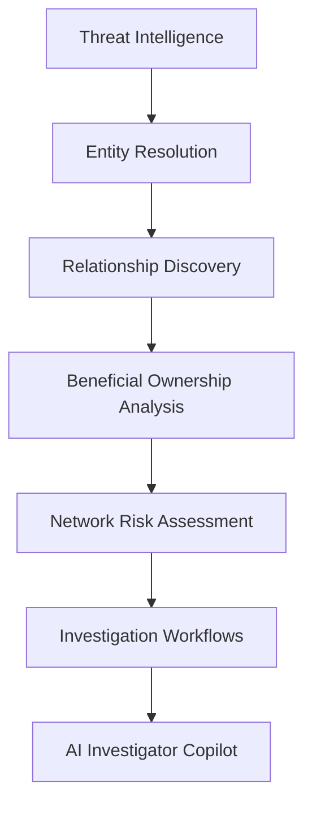
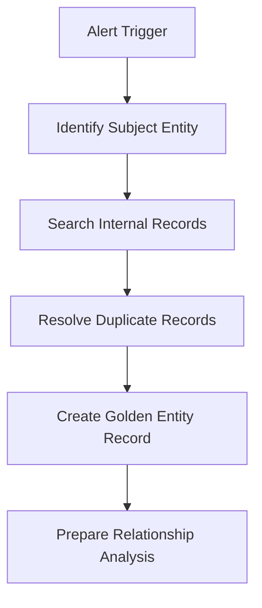
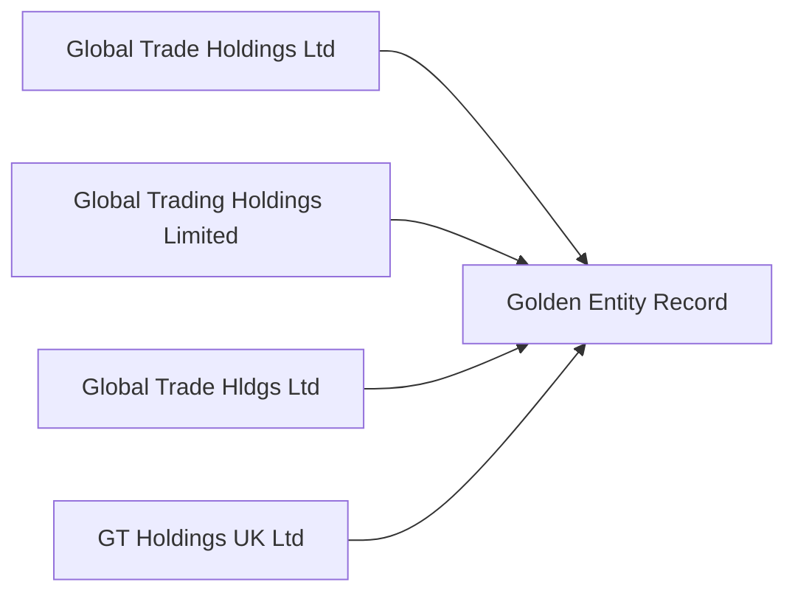

# Entity Resolution

> Network Intelligence Capability 01

Transforming fragmented customer records into trusted investigative identities.

---

# Executive Summary

Financial institutions frequently maintain multiple representations of the same customer, organisation, director, or beneficial owner across disparate systems.

This fragmentation creates investigative blind spots, weakens risk assessments, and limits the effectiveness of network analytics.

Entity Resolution establishes a trusted intelligence layer by identifying, matching, and consolidating records that represent the same real-world entity.

This capability forms the foundation of Network Intelligence and enables downstream capabilities including Relationship Discovery, Beneficial Ownership Analysis, Network Risk Assessment, Investigation Workflows, and AI-Enabled Investigation.

---

# Intelligence Outcome

Entity Resolution creates a trusted investigative identity by consolidating fragmented records that represent the same individual or organisation.

## Primary Outputs

- Golden Entity Records
- Consolidated Customer Profiles
- Entity Match Confidence Scores
- Network Intelligence Nodes
- Investigation-Ready Intelligence
- Trusted Inputs for AI Investigation

---

# Capability Position Within The Financial Crime Intelligence Platform



---

# Investigation Framework

This showcase is structured around six questions that underpin intelligence-led financial crime operations.

| Question | Purpose |
|-----------|----------|
| Why does the problem exist? | Understand the operational challenge |
| What intelligence do we need? | Define the intelligence objective |
| How do investigators work? | Understand the investigative workflow |
| How is analytics applied? | Demonstrate analytical methods |
| What intelligence is produced? | Show investigative outputs |
| What happens next? | Connect to the next capability |

---

# 1. Why Does The Problem Exist?

## Business Problem

Banks rarely operate a single customer platform.

Customer information is typically distributed across:

- Core Banking Systems
- Payments Platforms
- Trade Finance Platforms
- KYC Systems
- Customer Onboarding Platforms
- External Intelligence Sources

As a result, the same organisation may appear multiple times under slightly different identities.

## NI001 - Entity Resolution Intelligence Pattern


### Example

| Source System | Entity Name |
|---------------|------------|
| Retail Banking | Global Trade Holdings Ltd |
| Trade Finance | Global Trading Holdings Limited |
| Payments Platform | Global Trade Hldgs Ltd |
| KYC Platform | GT Holdings UK Ltd |

At first glance these appear to be separate entities.

In reality they may represent the same organisation.

Without Entity Resolution:

- Risk becomes fragmented
- Relationships remain hidden
- Investigations become incomplete
- Network analytics become unreliable

---

# 2. What Intelligence Do We Need?

## Intelligence Objective

> Determine whether multiple records represent the same real-world individual or organisation.

The objective is to create a trusted investigative identity that can be used consistently across the Financial Crime Intelligence Platform.

## Key Intelligence Questions

- Have we seen this entity before?
- Which systems contain related records?
- What is the complete customer profile?
- What relationships might be hidden?
- What is the true risk exposure?

---

# 3. How Do Investigators Work?

## Investigation Workflow

A financial crime alert typically initiates an investigation.

Before relationships can be analysed, investigators must determine whether multiple records refer to the same entity.



---

## Golden Record Creation



---

# 4. How Is Analytics Applied?

## Entity Resolution Methodology

Entity Resolution combines deterministic matching, probabilistic matching, confidence scoring, and analyst review to create trusted investigative identities.

## NI001A - Entity Resolution Methodology


## Analytical Stages

### 1. Data Standardisation

Customer data is cleaned and normalised across source systems.

Examples include:

- Legal suffix standardisation
- Address normalisation
- Country code harmonisation
- Identifier validation
- Removal of formatting inconsistencies

### 2. Deterministic Matching

High-confidence matching is performed using trusted identifiers.

Examples include:

- Company Registration Number
- Legal Entity Identifier (LEI)
- Tax Identifier
- Passport Number
- National ID
- SWIFT/BIC

### 3. Probabilistic Matching

Where trusted identifiers are incomplete or unavailable, probabilistic matching is applied.

Signals may include:

- Name similarity
- Address similarity
- Director overlap
- Beneficial owner overlap
- Telephone number similarity
- Email domain similarity

### 4. Confidence Scoring

Each potential match is assigned a confidence score.

High-confidence matches may be resolved automatically.

Medium-confidence matches are routed for analyst review.

Low-confidence matches are rejected.

### 5. Golden Record Creation

Confirmed matches are consolidated into a single investigative identity.

This becomes the trusted entity record used by downstream Network Intelligence capabilities.

---

## NI001B - Entity Resolution Architecture


---

# 5. What Intelligence Is Produced?

Entity Resolution produces investigation-ready intelligence that can be used by analysts, financial intelligence units, risk teams, and AI-enabled investigation tools.

## NI001C - Entity Resolution Intelligence Outputs


### Golden Entity Records

A single trusted identity representing the real-world individual or organisation.

### Consolidated Customer Profiles

A complete customer view across source systems, products, accounts, jurisdictions, and identifiers.

### Match Confidence Scores

Transparent scoring that shows why records were matched and whether analyst review was required.

### Investigative Entity Profiles

Profiles that summarise:

- Source systems
- Linked accounts
- Associated identifiers
- Known directors
- Beneficial owners
- Jurisdictions
- Risk indicators

### Network Intelligence Inputs

Resolved entities become trusted nodes for:

- Relationship Discovery
- Beneficial Ownership Analysis
- Network Risk Assessment
- Investigation Workflows
- AI Investigator Copilot

---

# 6. What Happens Next?

Entity Resolution establishes trusted investigative identities.

The next capability identifies how those entities are connected through:

- Transactions
- Shared Accounts
- Counterparties
- Directors
- Ownership Structures
- Financial Relationships

---

## Intelligence Journey

```text
Entity Resolution
        ↓
Relationship Discovery
        ↓
Beneficial Ownership Analysis
        ↓
Network Risk Assessment
        ↓
Investigation Workflows
        ↓
AI Investigator Copilot
```

---

# Navigation

⬅️ [Previous: Network Intelligence Overview](../README.md)

➡️ [Next: Relationship Discovery](../02-relationship-discovery/README.md)
