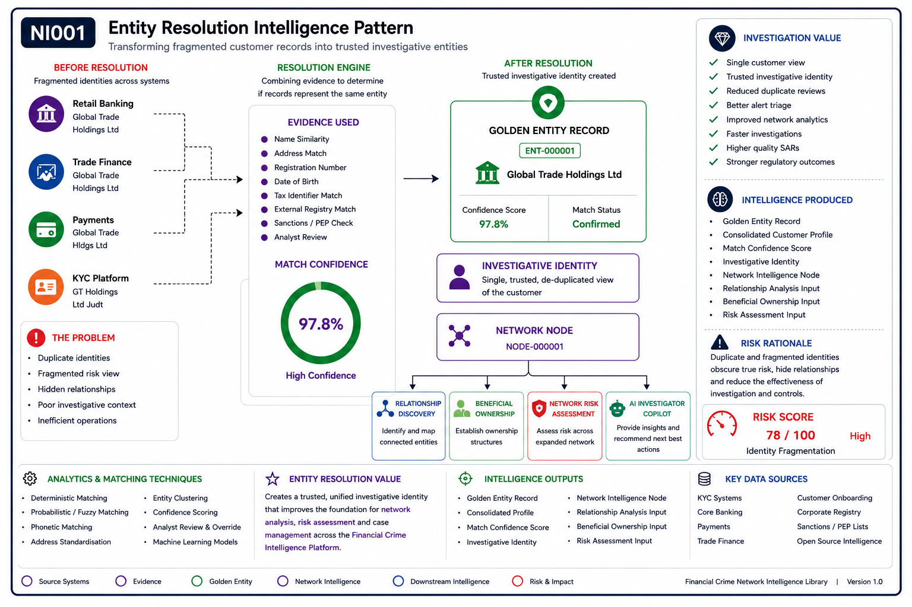
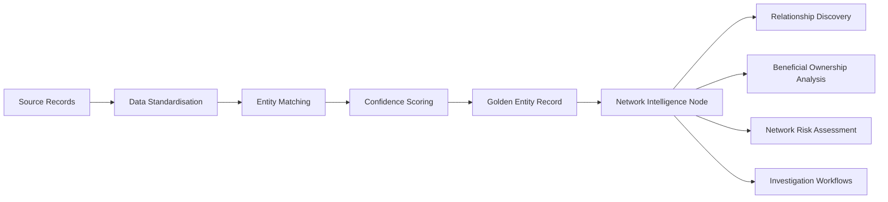

# Entity Resolution

> Network Intelligence Capability 01

Transforming fragmented customer records into trusted investigative identities.

---

## Executive Summary

Financial institutions frequently maintain multiple representations of the same customer, organisation, director, or beneficial owner across disparate systems.

This fragmentation creates investigative blind spots, weakens risk assessments, and limits the effectiveness of network analytics.

Entity Resolution establishes a trusted intelligence layer by identifying, matching, and consolidating records that represent the same real-world entity.

This capability forms the foundation of Network Intelligence and enables downstream capabilities including Relationship Discovery, Beneficial Ownership Analysis, Network Risk Assessment, Investigation Workflows, and AI-Enabled Investigation.

---

## Intelligence Outcome

Entity Resolution creates a trusted investigative identity by consolidating fragmented records that represent the same individual, organisation, or counterparty.

### Primary Outputs

- Golden Entity Records
- Consolidated Customer Profiles
- Entity Match Confidence Scores
- Network Intelligence Nodes
- Investigation-Ready Intelligence
- Trusted Inputs for AI Investigation

---

## Visual Intelligence Pattern

---

## Business Value

- Reduces duplicate investigations
- Improves customer and counterparty visibility
- Strengthens financial crime risk assessment
- Enables relationship discovery and network analytics
- Improves investigation quality and consistency
- Provides trusted data for AI-enabled workflows

---

## Analytical Stages

### Stage 1 – Data Ingestion

Entity data is collected from source systems including:

- Core Banking
- Payments
- Trade Finance
- KYC Systems
- Customer Onboarding
- Corporate Registries
- Sanctions / PEP Lists
- Open Source Intelligence

### Stage 2 – Standardisation

Input records are standardised to improve comparability.

Examples include:

- Name normalisation
- Address standardisation
- Identifier formatting
- Date of birth standardisation
- Country and jurisdiction alignment

### Stage 3 – Matching

Records are compared using deterministic, probabilistic, fuzzy, and rules-based matching techniques.

Matching signals include:

- Name similarity
- Address similarity
- Registration numbers
- Tax identifiers
- Date of birth
- Phone numbers
- Email addresses
- External registry identifiers

### Stage 4 – Confidence Scoring

Potential matches are assigned confidence scores based on the strength and quality of available evidence.

### Stage 5 – Golden Entity Creation

Confirmed matches are consolidated into a trusted golden entity record.

---

## Entity Resolution Workflow

---

## Navigation

⬅️ **Previous:** [Network Intelligence Overview](../README.md)

➡️ **Next:** [Relationship Discovery](../02-relationship-discovery/README.md)

---

## Key Message

Entity Resolution answers:

> "Who is this entity?"

It creates the trusted identity layer required for every downstream Network Intelligence capability.

---
