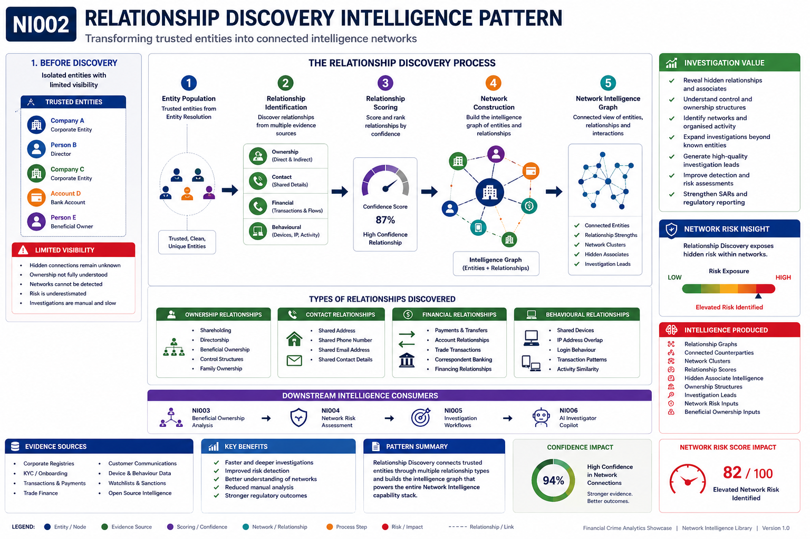
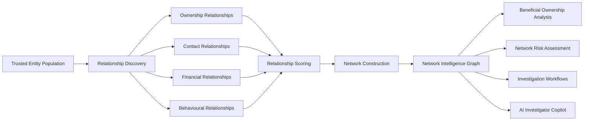

# NI002 – Relationship Discovery Intelligence Pattern

**Network Intelligence Capability 02**

Transforming isolated entities into connected intelligence networks.

---

# Executive Summary

Financial institutions often possess large volumes of customer, counterparty, payment, trade, and corporate information but lack visibility of the relationships connecting those entities across the enterprise.

Even when individual customers and organisations have been successfully resolved into trusted identities, investigators frequently struggle to understand how those entities interact with each other.

Relationship Discovery establishes the intelligence layer that connects entities through ownership, control, communication, transaction, geographic, and behavioural relationships.

By exposing these hidden connections, investigators can identify criminal networks, organised structures, intermediaries, beneficial ownership chains, and broader financial crime ecosystems that would otherwise remain undetected.

This capability transforms isolated customer records into actionable intelligence networks.

---

# Visual Intelligence Pattern



### Pattern Objective

Relationship Discovery transforms trusted entities into connected intelligence networks.

Where Entity Resolution answers:

> "Who is this entity?"

Relationship Discovery answers:

> "Who are they connected to?"

The capability identifies ownership structures, contact links, transactional relationships, behavioural connections, and hidden associates across customers, counterparties, organisations, and networks.

The resulting intelligence graph becomes the foundation for:

- Beneficial Ownership Analytics
- Network Risk Assessment
- Investigation Workflows
- AI Investigator Copilots
- Graph Analytics
- Network Intelligence Platforms

---

# Capability Dependencies

## Upstream Dependency

- NI001 – Entity Resolution Intelligence Pattern

## Downstream Capabilities Enabled

- NI003 – Beneficial Ownership Intelligence Pattern
- NI004 – Network Risk Assessment Intelligence Pattern
- NI005 – Investigation Workflow Intelligence Pattern

---

# Relationship Discovery Lifecycle



---

# How Relationship Discovery Works

## Stage 1 – Trusted Entity Population

Relationship Discovery begins with a population of trusted entities generated through Entity Resolution.

Examples include:

- Customers
- Companies
- Directors
- Beneficial Owners
- Accounts
- Counterparties

Each entity possesses a trusted identity and unique identifier.

---

## Stage 2 – Relationship Identification

The platform identifies relationships between entities using multiple evidence sources.

### Direct Relationships

- Ownership
- Directorship
- Shareholding
- Account Control
- Authorised Signatories

### Contact Relationships

- Shared Address
- Shared Phone Number
- Shared Email Address

### Financial Relationships

- Payment Flows
- Account Transfers
- Trade Transactions
- Correspondent Banking Activity

### Behavioural Relationships

- Shared Devices
- Shared IP Addresses
- Shared Access Patterns
- Common Transaction Behaviour

---

## Stage 3 – Relationship Scoring

Relationships are evaluated and assigned confidence scores based on evidence quality.

Factors include:

- Evidence strength
- Data quality
- Relationship frequency
- Relationship duration
- Source reliability
- Number of corroborating indicators

The result is a trusted intelligence network.

---

## Stage 4 – Network Construction

Entities and relationships are assembled into a graph network.

The network contains:

- Nodes (Entities)
- Edges (Relationships)
- Relationship Types
- Relationship Strength
- Investigation Context

The resulting graph becomes the foundation for advanced analytics.

---

# Intelligence Produced

Relationship Discovery generates:

| Intelligence Output | Description |
|----------|-------------|
| Relationship Graphs | Visual representation of connected entities |
| Network Intelligence Nodes | Trusted entities connected through relationships |
| Relationship Scores | Confidence scoring for discovered links |
| Network Clusters | Groups of connected entities |
| Connected Counterparties | Known and previously unknown associates |
| Hidden Associate Intelligence | Newly discovered network participants |
| Ownership Structures | Connected ownership and control relationships |
| Investigation Leads | New investigative opportunities |
| Network Risk Inputs | Inputs for risk scoring and prioritisation |
| Beneficial Ownership Inputs | Foundation for ownership analytics |

---

# How Investigators Use It

## Investigation Example

An investigator begins with a single company subject.

Relationship Discovery reveals:

- Common directors
- Shared addresses
- Shared bank accounts
- Connected counterparties
- Historical payment relationships

Within minutes the investigator can identify:

- Additional entities requiring review
- Hidden ownership structures
- High-risk network participants
- Potential mule accounts
- Organised criminal networks

The investigation expands from a single entity into a complete intelligence network.

---

# Business Benefits

## Investigation Benefits

- Faster investigations
- Improved lead generation
- Reduced manual analysis
- Better understanding of criminal structures
- Improved case quality

## Risk Benefits

- Improved detection of hidden risk
- Greater visibility of control structures
- Enhanced network analytics
- Better identification of organised activity

## Regulatory Benefits

- Stronger SAR investigations
- Improved AML controls
- Better auditability
- Enhanced explainability
- More effective regulatory reporting

---

# Relationship Discovery within the Network Intelligence Journey

```text
Entity Resolution
        ↓
Relationship Discovery
        ↓
Beneficial Ownership Analysis
        ↓
Network Risk Assessment
        ↓
Investigation Workflows
        ↓
AI Investigator Copilot
```

Relationship Discovery is the capability that transforms trusted identities into trusted intelligence networks.

---

# Key Message

Entity Resolution answers:

**"Who is this entity?"**

Relationship Discovery answers:

**"Who are they connected to?"**

Together they establish the foundation of network intelligence and graph-based financial crime investigations.

---

# Navigation

⬅️ Previous: [NI001 – Entity Resolution Intelligence Pattern](../01-entity-resolution/README.md)

➡️ Next: [NI003 – Beneficial Ownership Intelligence Pattern](../03-beneficial-ownership/README.md)

---
