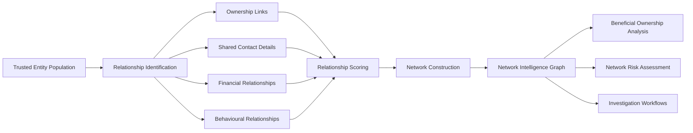

# NI002 – Relationship Discovery Intelligence Pattern

Transforming trusted entities into connected intelligence networks

---

## Executive Summary

Financial institutions often possess large volumes of customer, counterparty, payment, trade, account, and corporate registry data but lack visibility of the relationships connecting those entities.

While Entity Resolution establishes confidence in who a customer or organisation is, Relationship Discovery establishes how those entities interact with one another.

The capability identifies ownership, financial, behavioural, and contact-based relationships, assigns confidence scores, and constructs trusted intelligence networks that support investigations, risk assessments, beneficial ownership analysis, and AI-enabled investigative workflows.

Relationship Discovery transforms isolated customer records into connected intelligence networks.

---

# 1. Why Does The Problem Exist?

## Business Problem

Even after customer records have been successfully resolved into trusted identities, investigators frequently struggle to understand:

- Who controls an organisation
- Which entities are connected
- Whether hidden networks exist
- How money moves between participants
- Which counterparties operate together
- Whether criminal structures are present

As a result:

- Criminal structures remain hidden
- Investigations become manual
- Network risks are missed
- High-risk entities remain undiscovered
- Analysts review information in isolation

---

## Intelligence Objective

Relationship Discovery answers:

> "Who are they connected to?"

The capability identifies, validates, scores, and visualises relationships between trusted entities.

---

# 2. Analytical Stages

## Stage 1 – Trusted Entity Population

Input entities originate from:

- NI001 Entity Resolution
- Customer Platforms
- KYC Systems
- Payments Platforms
- Trade Finance Platforms
- External Intelligence Sources

### Output

Trusted Investigative Entities

---

## Stage 2 – Relationship Identification

The platform identifies relationships between entities using multiple evidence sources.

### Ownership Relationships

- Shareholding
- Corporate Ownership
- Beneficial Ownership
- Control Structures

### Contact Relationships

- Shared Address
- Shared Phone Number
- Shared Email Address
- Shared Contact Details

### Financial Relationships

- Payment Flows
- Account Transfers
- Trade Transactions
- Correspondent Banking Activity

### Behavioural Relationships

- Shared Devices
- Shared IP Addresses
- Similar Access Patterns
- Common Transaction Behaviour

### Output

Candidate Relationships

---

## Stage 3 – Relationship Scoring

Relationships are evaluated and assigned confidence scores.

Scoring factors include:

- Evidence strength
- Data quality
- Relationship frequency
- Relationship duration
- Source reliability
- Number of corroborating indicators

### Output

Trusted Relationships

---

## Stage 4 – Network Construction

Entities and relationships are assembled into a graph structure.

The network contains:

- Nodes
- Edges
- Relationship Types
- Relationship Strength
- Investigation Context

### Output

Network Intelligence Graph

---

## Stage 5 – Intelligence Consumption

The resulting graph becomes available for:

- Beneficial Ownership Analytics
- Network Risk Assessment
- Investigation Workflows
- AI Investigator Copilots
- Intelligence Reporting

### Output

Actionable Investigative Intelligence

---

# 3. Intelligence Produced

| Intelligence Output | Description |
|---------------------|-------------|
| Relationship Graphs | Visual representation of connected entities |
| Network Intelligence Nodes | Trusted entities connected through relationships |
| Relationship Scores | Confidence scoring for discovered links |
| Network Clusters | Groups of connected entities |
| Connected Counterparties | Known and previously unknown associates |
| Hidden Associate Intelligence | Newly discovered network participants |
| Ownership Structures | Connected ownership and control relationships |
| Investigation Leads | New investigative opportunities |
| Network Risk Inputs | Inputs for risk scoring and prioritisation |
| Beneficial Ownership Inputs | Foundation for ownership analytics |

---

# 4. How Investigators Use It

## Investigation Example

An investigator begins with:

**Global Trade Holdings Ltd**

Relationship Discovery reveals:

- Shared directors
- Shared addresses
- Shared payment activity
- Connected counterparties
- Historical transaction relationships

The network expands from:

```text
1 Company
```

to:

```text
37 Connected Entities
```

Including:

- Previously unknown associates
- Hidden ownership structures
- High-risk network participants
- Additional investigative leads

The investigation expands from a single entity into a complete intelligence network.

---

# 5. Business Benefits

## Investigation Benefits

- Faster investigations
- Reduced manual analysis
- Improved lead generation
- Better understanding of criminal structures
- Higher quality investigations

### Risk Benefits

- Improved detection of hidden risk
- Greater visibility of control structures
- Enhanced network analytics
- Better identification of organised activity

### Regulatory Benefits

- Stronger AML investigations
- Improved SAR quality
- Better auditability
- Enhanced regulatory transparency

---

# 6. Capability Dependencies

## Upstream Dependency

- NI001 – Entity Resolution Intelligence Pattern

## Downstream Capabilities Enabled

- NI003 – Beneficial Ownership Intelligence Pattern
- NI004 – Network Risk Assessment Intelligence Pattern
- NI005 – Investigation Workflow Intelligence Pattern

---

## Capability Chain

```text
Entity Resolution
        ↓
Relationship Discovery
        ↓
Beneficial Ownership Analysis
        ↓
Network Risk Assessment
        ↓
Investigation Workflows
        ↓
AI Investigator Copilot
```

---

# Relationship Discovery Workflow



---

# Key Message

Entity Resolution answers:

> "Who is this entity?"

Relationship Discovery answers:

> "Who are they connected to?"

Together they establish the foundation for graph-based financial crime intelligence.

---

# Navigation

⬅️ **Previous:** [Network Intelligence Overview](../README.md)

➡️ **Next:** [Beneficial Ownership Analysis](../03-beneficial-ownership/README.md)

---
