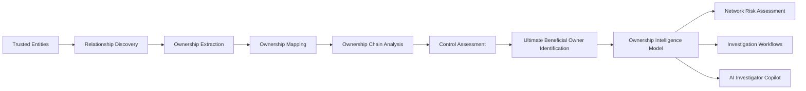

# NI003 – Beneficial Ownership Intelligence Pattern

> Network Intelligence Capability 03

Uncovering ultimate ownership and control across complex organisational structures.

---

## Executive Summary

Financial institutions frequently struggle to identify the true individuals who ultimately own, control, or benefit from legal entities.

Ownership structures are often layered across multiple jurisdictions, holding companies, trusts, nominees, intermediaries, and shell entities, creating significant transparency challenges for investigators, compliance teams, and risk functions.

While Relationship Discovery identifies how entities connect, Beneficial Ownership Intelligence determines who ultimately sits behind those relationships and exercises effective ownership or control.

By consolidating ownership structures into transparent control hierarchies, investigators can identify hidden beneficial owners, nominee arrangements, ownership concentration risks, sanctions exposure, politically exposed person (PEP) relationships, and organised financial crime structures.

This capability transforms relationship networks into ownership intelligence.

---

## Visual Intelligence Pattern


---

## Intelligence Question

> Who ultimately owns or controls this entity?

Beneficial Ownership Intelligence identifies the natural persons who ultimately own, control, influence, or benefit from legal entities and organisational structures.

This capability transforms relationship networks into transparent ownership intelligence.

---

## Pattern Objective

Beneficial Ownership Intelligence extends Relationship Discovery by tracing ownership and control relationships through complex corporate, legal, and financial structures.

The capability identifies:

- Ultimate Beneficial Owners (UBOs)
- Direct and indirect ownership
- Control relationships
- Trust beneficiaries
- Nominee arrangements
- Corporate ownership chains
- Hidden ownership structures
- Ownership concentration risks

The resulting ownership intelligence becomes the foundation for:

- Enhanced Due Diligence
- Sanctions Investigations
- PEP Investigations
- Network Risk Assessment
- Investigation Workflows
- AI Investigator Copilots

---

## Capability Dependencies

This capability depends on:

- [NI001 – Entity Resolution Intelligence Pattern](../01-entity-resolution/README.md)
- [NI002 – Relationship Discovery Intelligence Pattern](../02-relationship-discovery/README.md)

---

## Downstream Capabilities Enabled

- [NI004 – Network Risk Assessment Intelligence Pattern](../04-network-risk-assessment/README.md)
- [NI005 – Investigation Workflow Intelligence Pattern](../05-investigation-workflows/README.md)

---

## Beneficial Ownership Lifecycle



---

## How Beneficial Ownership Works

### Stage 1 – Ownership Data Collection

Ownership information is collected from multiple internal and external sources.

Examples include:

- Corporate Registries
- Shareholder Registers
- KYC Records
- Customer Documentation
- Trust Structures
- Regulatory Filings
- Commercial Data Providers

The resulting data provides the foundation for ownership analysis.

---

### Stage 2 – Ownership Mapping

The platform identifies ownership relationships between individuals and organisations.

Examples include:

- Direct Shareholding
- Indirect Shareholding
- Director Relationships
- Trustee Relationships
- Beneficiary Relationships
- Corporate Control Structures

The result is a connected ownership graph.

---

### Stage 3 – Ownership Chain Analysis

Ownership chains are recursively traversed through multiple legal entities.

Examples include:

- Parent Companies
- Holding Companies
- Subsidiaries
- Offshore Structures
- Trust Arrangements
- Nominee Holdings

The platform identifies the complete ownership path from entity to individual.

---

### Stage 4 – Control Assessment

Ownership does not always equal control.

The platform evaluates:

- Voting Rights
- Board Influence
- Executive Control
- Trustee Authority
- Management Control
- Contractual Influence

This establishes effective control relationships.

---

### Stage 5 – Ultimate Beneficial Owner Identification

The platform identifies the natural persons who ultimately own or control the structure.

Factors include:

- Ownership Percentage
- Control Thresholds
- Regulatory Definitions
- Jurisdictional Rules
- Effective Control Indicators

The result is a trusted beneficial ownership model.

---

## Intelligence Produced

| Intelligence Output | Description |
|---------------------|-------------|
| Ultimate Beneficial Owners | Individuals with ultimate ownership or control |
| Ownership Structures | Complete ownership hierarchies |
| Ownership Chains | Multi-layer ownership paths |
| Control Structures | Effective control relationships |
| Hidden Owners | Previously unidentified beneficial owners |
| Nominee Relationships | Potential nominee arrangements |
| Ownership Concentration | High ownership exposure indicators |
| Sanctions Exposure Links | Ownership connections to sanctioned parties |
| PEP Exposure Links | Ownership connections to politically exposed persons |
| Ownership Risk Inputs | Inputs for risk scoring and prioritisation |

---

## How Investigators Use It

### Investigation Example

An investigator begins with a corporate customer.

Beneficial Ownership Intelligence reveals:

- Multiple ownership layers
- Offshore holding entities
- Common ownership structures
- Previously unknown shareholders
- Hidden controlling parties

Within minutes the investigator can identify:

- Ultimate Beneficial Owners
- Hidden control relationships
- Sanctions exposure risks
- PEP exposure risks
- Organised ownership structures

The investigation expands from a legal entity into a complete ownership intelligence model.

---

## Business Benefits

### Investigation Benefits

- Faster ownership investigations
- Reduced manual ownership tracing
- Improved transparency
- Better identification of hidden owners
- Improved investigative outcomes

### Risk Benefits

- Stronger ownership risk visibility
- Improved sanctions controls
- Improved PEP identification
- Better customer risk assessment
- Enhanced network analytics

### Regulatory Benefits

- Improved UBO compliance
- Stronger KYC controls
- Enhanced AML controls
- Better regulatory reporting
- Increased ownership transparency

---

## Network Intelligence Journey

```text
Entity Resolution
        ↓
Relationship Discovery
        ↓
Beneficial Ownership Analysis
        ↓
Network Risk Assessment
        ↓
Investigation Workflows
        ↓
AI Investigator Copilot
```

---

## Navigation

⬅️ **Previous:** [Relationship Discovery](../02-relationship-discovery/README.md)

➡️ **Next:** [Network Risk Assessment](../04-network-risk-assessment/README.md)

---

## Key Message

Relationship Discovery answers:

> "Who are they connected to?"

Beneficial Ownership Intelligence answers:

> "Who ultimately owns or controls this entity?"

Together they transform relationship networks into transparent ownership intelligence that supports financial crime investigations, risk management, and regulatory compliance.
