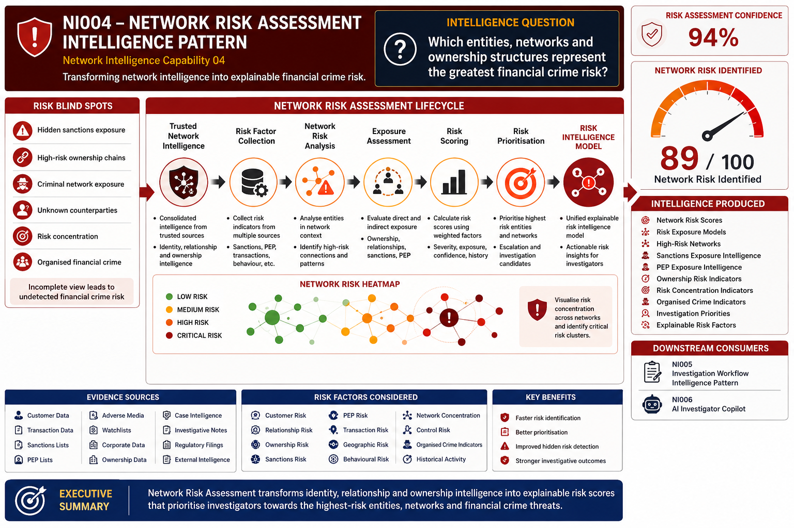

# NI004 – Network Risk Assessment Intelligence Pattern

> Network Intelligence Capability 04

Transforming network intelligence into explainable financial crime risk.

---

## Executive Summary

Financial institutions often possess vast amounts of customer, transaction, ownership, and relationship data but struggle to determine which entities, networks, and structures present the greatest financial crime risk.

Traditional risk models frequently evaluate customers in isolation, overlooking the broader network context surrounding individuals, organisations, counterparties, beneficial owners, and connected entities.

Network Risk Assessment extends Entity Resolution, Relationship Discovery, and Beneficial Ownership Intelligence by combining identity, relationship, ownership, behavioural, and exposure intelligence into a unified network risk model.

By evaluating entities within the context of their surrounding network, investigators can identify hidden risk, organised financial crime structures, sanctions exposure, money laundering typologies, mule networks, beneficial ownership risk, and previously undetected criminal ecosystems.

This capability transforms network intelligence into actionable risk intelligence.

---

## Visual Intelligence Pattern

---

## Intelligence Question

> Which entities, networks, and ownership structures represent the greatest financial crime risk?

Network Risk Assessment evaluates entities within their broader network context to identify, prioritise, and explain financial crime risk.

This capability transforms network intelligence into risk intelligence.

---

## Pattern Objective

Network Risk Assessment consolidates multiple intelligence sources into a unified risk model.

The capability evaluates:

- Customer Risk
- Relationship Risk
- Beneficial Ownership Risk
- Sanctions Exposure Risk
- PEP Exposure Risk
- Transaction Risk
- Geographic Risk
- Behavioural Risk
- Network Concentration Risk
- Organised Crime Indicators

The resulting risk intelligence becomes the foundation for:

- Alert Prioritisation
- Case Management
- Investigation Workflows
- Enhanced Due Diligence
- Regulatory Reporting
- AI Investigator Copilots

---

## Capability Dependencies

This capability depends on:

- [NI001 – Entity Resolution Intelligence Pattern](../01-entity-resolution/README.md)
- [NI002 – Relationship Discovery Intelligence Pattern](../02-relationship-discovery/README.md)
- [NI003 – Beneficial Ownership Intelligence Pattern](../03-beneficial-ownership/README.md)

---

## Downstream Capabilities Enabled

- [NI005 – Investigation Workflow Intelligence Pattern](../05-investigation-workflows/README.md)
- [NI006 – AI Investigator Copilot](../06-ai-investigator-copilot/README.md)

---

## Network Risk Assessment Lifecycle

~~~mermaid
flowchart LR

A[Trusted Entities] --> B[Relationship Discovery]

B --> C[Beneficial Ownership Intelligence]

C --> D[Risk Factor Collection]

D --> E[Network Risk Scoring]

E --> F[Risk Prioritisation]

F --> G[Risk Intelligence Model]

G --> H[Investigation Workflows]

G --> I[Case Management]

G --> J[AI Investigator Copilot]
~~~

---

## How Network Risk Assessment Works

### Stage 1 – Risk Factor Collection

The platform gathers risk indicators from multiple intelligence sources.

Examples include:

- Customer Risk Ratings
- Transaction Monitoring Alerts
- Sanctions Matches
- PEP Matches
- Adverse Media
- Geographic Risk
- Behavioural Indicators
- Ownership Intelligence

The resulting intelligence provides the foundation for risk assessment.

---

### Stage 2 – Network Risk Analysis

Entities are evaluated within their surrounding network.

Examples include:

- High-Risk Counterparties
- Sanctioned Associates
- Shared Ownership Structures
- High-Risk Relationships
- Known Criminal Networks
- Concentrated Risk Clusters

This reveals hidden network exposure.

---

### Stage 3 – Exposure Assessment

The platform evaluates direct and indirect exposure.

Examples include:

- First-Degree Relationships
- Second-Degree Relationships
- Ownership Exposure
- Control Exposure
- Sanctions Exposure
- PEP Exposure

The platform identifies how risk propagates through networks.

---

### Stage 4 – Risk Scoring

Risk indicators are consolidated into explainable risk scores.

Assessment factors include:

- Risk Severity
- Exposure Strength
- Relationship Confidence
- Ownership Confidence
- Transaction Frequency
- Behavioural Indicators
- Historical Activity

This establishes a trusted network risk score.

---

### Stage 5 – Risk Prioritisation

The highest-risk entities and networks are prioritised.

Outputs include:

- High-Risk Customers
- High-Risk Networks
- Escalation Candidates
- Investigation Priorities
- Enhanced Due Diligence Targets

The result is a risk-ranked intelligence model.

---

## Intelligence Produced

| Intelligence Output | Description |
|---------------------|-------------|
| Network Risk Scores | Risk scores for entities and networks |
| High-Risk Networks | Networks requiring investigation |
| Risk Exposure Models | Direct and indirect exposure analysis |
| Sanctions Exposure Intelligence | Exposure to sanctioned parties |
| PEP Exposure Intelligence | Exposure to politically exposed persons |
| Ownership Risk Indicators | Beneficial ownership risk factors |
| Network Concentration Risk | Risk concentration indicators |
| Organised Crime Indicators | Network patterns linked to criminal activity |
| Investigation Priorities | Prioritised investigative targets |
| Explainable Risk Factors | Drivers behind risk assessments |

---

## How Investigators Use It

### Investigation Example

An investigator begins with a medium-risk customer.

Network Risk Assessment reveals:

- Connections to high-risk counterparties
- Indirect sanctions exposure
- Shared ownership structures
- High-risk behavioural indicators
- Membership of a suspicious network cluster

Within minutes the investigator can identify:

- Escalation candidates
- Hidden network exposure
- Ownership-related risks
- Sanctions-related concerns
- Organised financial crime indicators

The investigation expands from a single customer review into a complete network risk assessment.

---

## Business Benefits

### Investigation Benefits

- Faster risk identification
- Better investigative prioritisation
- Reduced manual analysis
- Improved hidden risk detection
- Stronger investigative outcomes

### Risk Benefits

- Enhanced customer risk assessment
- Improved network visibility
- Better sanctions risk management
- Improved ownership risk understanding
- More effective risk prioritisation

### Regulatory Benefits

- Stronger AML controls
- Improved risk governance
- Better explainability
- Enhanced auditability
- Improved regulatory reporting

---

## Network Intelligence Journey

~~~text
Entity Resolution
        ↓
Relationship Discovery
        ↓
Beneficial Ownership Analysis
        ↓
Network Risk Assessment
        ↓
Investigation Workflows
        ↓
AI Investigator Copilot
~~~

---

## Navigation

⬅️ **Previous:** [Beneficial Ownership](../03-beneficial-ownership/README.md)

➡️ **Next:** [Investigation Workflows](../05-investigation-workflows/README.md)

---

## Key Message

Entity Resolution answers:

> "Who is this entity?"

Relationship Discovery answers:

> "Who are they connected to?"

Beneficial Ownership Intelligence answers:

> "Who ultimately owns, controls, or benefits from this entity?"

Network Risk Assessment answers:

> "Which entities, networks, and ownership structures represent the greatest financial crime risk?"

Together these capabilities transform raw data into explainable network risk intelligence that supports investigations, compliance, and financial crime prevention.
