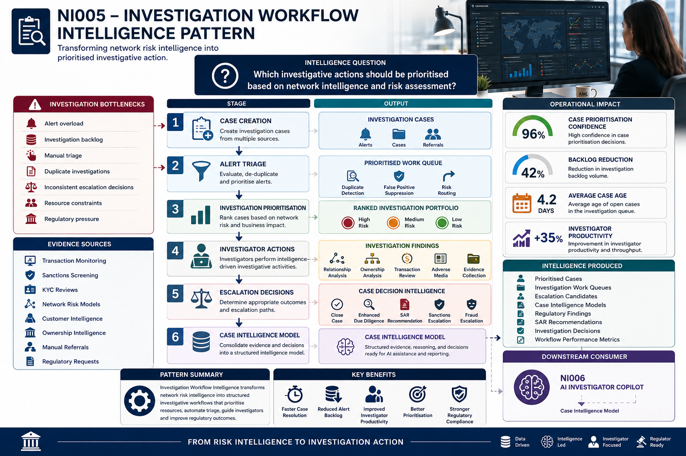

# NI005 – Investigation Workflow Intelligence Pattern

> Network Intelligence Capability 05

Transforming network risk intelligence into prioritised investigative action.

---

## Executive Summary

Financial institutions face increasing volumes of alerts, investigations, sanctions reviews, KYC escalations, and financial crime cases.

While network intelligence can identify risk, investigators still face significant operational challenges:

- Alert overload
- Investigation backlogs
- Manual triage processes
- Inconsistent escalation decisions
- Resource constraints
- Regulatory pressure

Investigation Workflow Intelligence operationalises network intelligence by transforming risk assessments into prioritised investigative actions, structured workflows, and documented case outcomes.

The capability creates a structured workflow that automatically routes, prioritises, escalates, and manages investigations based on risk.

By combining network intelligence with operational workflows, organisations can ensure investigators focus on the highest-risk entities, networks, and financial crime threats.

This capability transforms network risk intelligence into operational investigation intelligence.

---

## Visual Intelligence Pattern

---

## Intelligence Question

> Which investigative actions should be prioritised based on network intelligence and risk assessment?

Investigation Workflow Intelligence converts network intelligence into structured investigative actions that prioritise resources towards the highest-risk entities and networks.

This capability transforms risk intelligence into operational decision-making.

---

## Pattern Objective

Investigation Workflow Intelligence converts network risk intelligence into prioritised investigative workflows.

The capability enables:

- Case Creation
- Alert Triage
- Investigation Prioritisation
- Workflow Orchestration
- Escalation Management
- Investigator Guidance
- Regulatory Documentation

The objective is to ensure investigators focus on the most significant financial crime risks first.

---

## Capability Dependencies

This capability depends on:

- [NI001 – Entity Resolution Intelligence Pattern](../01-entity-resolution/README.md)
- [NI002 – Relationship Discovery Intelligence Pattern](../02-relationship-discovery/README.md)
- [NI003 – Beneficial Ownership Intelligence Pattern](../03-beneficial-ownership/README.md)
- [NI004 – Network Risk Assessment Intelligence Pattern](../04-network-risk-assessment/README.md)

---

## Downstream Capabilities Enabled

- [NI006 – AI Investigator Copilot](../06-ai-investigator-copilot/README.md)

---

## Investigation Workflow Lifecycle

~~~mermaid
flowchart LR

A[Risk Intelligence Inputs]
--> B[Case Creation]

B --> C[Alert Triage]

C --> D[Investigation Prioritisation]

D --> E[Investigator Actions]

E --> F[Escalation Decisions]

F --> G[Case Intelligence Model]

G --> H[AI Investigator Copilot]
~~~

---

## How Investigation Workflow Intelligence Works

### Stage 1 – Case Creation

The platform creates investigation cases from multiple intelligence sources.

Examples include:

- Transaction Monitoring Alerts
- Sanctions Alerts
- KYC Reviews
- Network Risk Intelligence
- Manual Referrals
- Regulatory Requests

Output:

- Investigation Cases

The resulting cases become candidates for triage and prioritisation.

---

### Stage 2 – Alert Triage

The platform evaluates incoming alerts and cases.

Examples include:

- Duplicate Detection
- False Positive Suppression
- Alert Consolidation
- Risk-Based Routing
- Priority Assignment
- Investigator Allocation

Output:

- Prioritised Work Queues

This ensures investigators focus on meaningful alerts.

---

### Stage 3 – Investigation Prioritisation

Cases are ranked based on network intelligence and risk indicators.

Assessment factors include:

- Network Risk Score
- Sanctions Exposure
- Ownership Risk
- Customer Risk Rating
- Transaction Activity
- Geographic Risk
- Regulatory Impact

Output:

- Ranked Investigation Portfolio

This establishes investigation priorities.

---

### Stage 4 – Investigator Actions

Investigators conduct targeted reviews supported by network intelligence.

Activities include:

- Relationship Analysis
- Ownership Analysis
- Transaction Review
- Adverse Media Research
- Network Exploration
- Evidence Collection

Output:

- Investigation Findings

The investigation becomes intelligence-driven rather than manually driven.

---

### Stage 5 – Escalation Decisions

Investigation findings drive operational decisions.

Examples include:

- Case Closure
- Enhanced Due Diligence
- SAR Recommendation
- Sanctions Escalation
- Fraud Escalation
- Regulatory Referral

Output:

- Case Outcome Intelligence

This converts findings into documented outcomes.

---

## Intelligence Produced

| Intelligence Output | Description |
|---------------------|-------------|
| Prioritised Cases | Ranked investigations |
| Investigation Work Queues | Investigator workload management |
| Escalation Candidates | Cases requiring action |
| Case Intelligence Models | Investigation evidence and context |
| Regulatory Findings | Reportable intelligence |
| SAR Recommendations | Suspicious activity indicators |
| Investigation Decisions | Final case outcomes |
| Workflow Performance Metrics | Operational intelligence |

---

## How Investigators Use It

### Investigation Example

An investigator receives a customer alert originating from Network Risk Assessment.

The network risk score indicates elevated exposure.

Investigation Workflow Intelligence automatically:

- Creates a case
- Assigns investigation priority
- Routes the case to the correct team
- Presents supporting intelligence
- Tracks investigative actions
- Generates escalation recommendations

The investigator immediately identifies:

- High-risk counterparties
- Indirect sanctions exposure
- Ownership-related risks
- Suspicious behavioural indicators
- Network-level financial crime concerns

Instead of spending time managing workflows, investigators focus on evidence and decision-making.

---

## Business Benefits

### Investigation Benefits

- Faster case resolution
- Better investigative prioritisation
- Reduced manual triage
- Improved investigator productivity
- More consistent investigative outcomes

### Operational Benefits

- Reduced alert backlog
- Improved workflow management
- Better resource utilisation
- Increased investigation throughput
- Lower operational costs

### Regulatory Benefits

- Consistent investigations
- Stronger audit trails
- Improved SAR quality
- Better governance
- Regulatory defensibility

---

## Network Intelligence Journey

~~~text
Network Intelligence Journey

Entity Resolution
        ↓
Relationship Discovery
        ↓
Beneficial Ownership Analysis
        ↓
Network Risk Assessment
        ↓
Investigation Workflows
        ↓
Case Intelligence
      ╱  │  │  ╲
     ╱   │  │   ╲
 TBML   CB  CM   Copilot
~~~
---

## Navigation

⬅️ **Previous:** [Network Risk Assessment](../04-network-risk-assessment/README.md)

### Intelligence Produced

This capability produces structured **Case Intelligence** for downstream Financial Crime analytics and investigation capabilities.

### Downstream Consumers

- [TBML Analytics](../../02-tbml-analytics/README.md)
- [Correspondent Banking Analytics](../../03-correspondent-banking-analytics/README.md)
- [Capital Markets Analytics](../../04-capital-markets-analytics/README.md)
- [Sanctions Screening Analytics](../../06-sanctions-screening-analytics/README.md)
- [AI Investigator Copilot](../../05-ai-investigator-copilot/README.md)

---

## Key Message

Entity Resolution answers:

> "Who is this entity?"

Relationship Discovery answers:

> "Who are they connected to?"

Beneficial Ownership Intelligence answers:

> "Who ultimately owns, controls, or benefits from this entity?"

Network Risk Assessment answers:

> "Which entities, networks, and ownership structures represent the highest priority financial crime risks?"

Investigation Workflow Intelligence answers:

> "What investigative actions should be taken and prioritised?"

Together these capabilities transform raw data into actionable investigation intelligence that supports financial crime operations, compliance, and regulatory outcomes.
