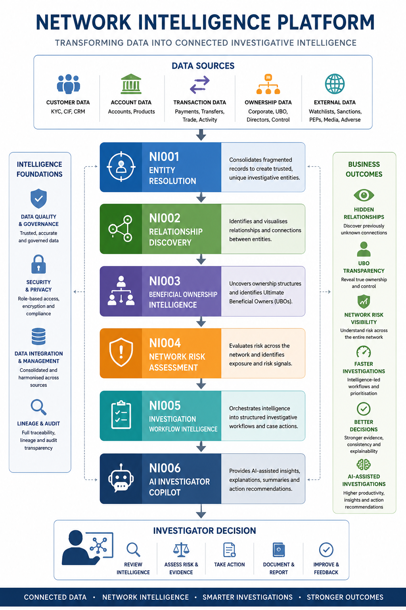
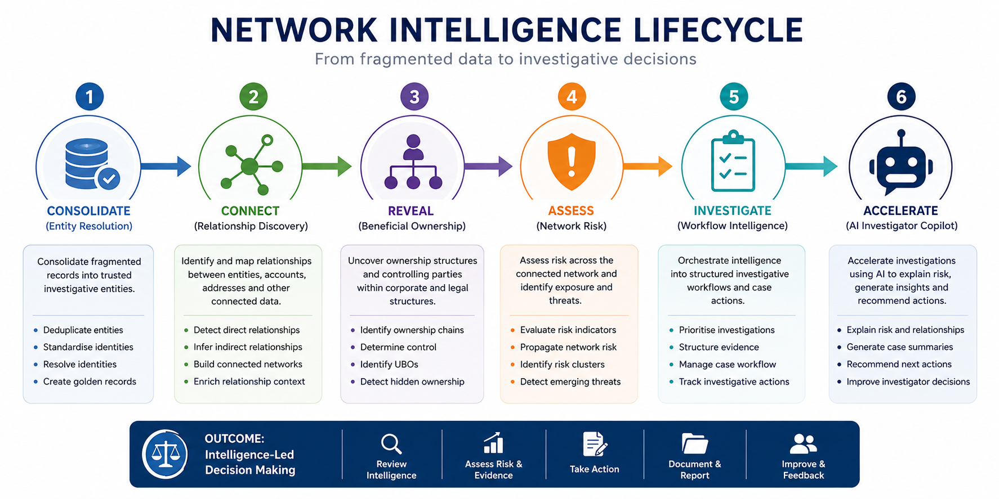
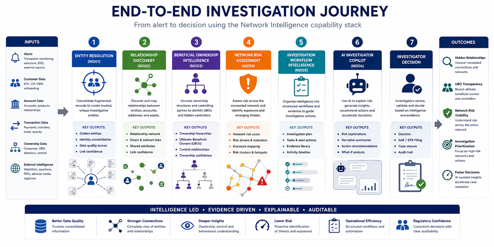

# Network Intelligence



Transforming fragmented customer, ownership, transaction and reference data into connected investigative intelligence.

---

## Executive Summary

Network Intelligence enables financial institutions to move beyond isolated customer records and investigate the relationships, ownership structures, behavioural patterns and risk exposures connecting entities across the financial ecosystem.

Traditional investigations often focus on individual customers or alerts in isolation. Network Intelligence connects entities, accounts, transactions, ownership structures and external intelligence sources to create a comprehensive investigative view.

The capability stack combines Entity Resolution, Relationship Discovery, Beneficial Ownership Intelligence, Network Risk Assessment, Investigation Workflow Intelligence and AI Investigator Copilot capabilities into a single intelligence-led investigation framework.

Together these capabilities enable investigators to:

- Identify hidden relationships between customers and organisations
- Reveal complex beneficial ownership structures
- Detect criminal networks operating across multiple entities
- Assess network-wide risk exposure
- Prioritise investigative effort using intelligence-driven workflows
- Accelerate decision-making through AI-assisted investigation support

Network Intelligence transforms raw data into actionable investigative intelligence, improving transparency, consistency, explainability and investigative effectiveness across AML, sanctions, fraud and financial crime operations.

---

## Network Intelligence Transformation Journey

The Network Intelligence capability stack follows a structured intelligence lifecycle.

```text
Customer Data
Account Data
Transaction Data
Ownership Data
External Intelligence

            ↓

NI001 Entity Resolution

            ↓

NI002 Relationship Discovery

            ↓

NI003 Beneficial Ownership Intelligence

            ↓

NI004 Network Risk Assessment

            ↓

NI005 Investigation Workflow Intelligence

            ↓

NI006 AI Investigator Copilot

            ↓

Investigator Decision
```

Each capability builds upon intelligence produced by the previous stage, progressively transforming raw information into investigative insight and actionable decision support.

---

## Intelligence Lifecycle



The Network Intelligence capability stack follows a structured intelligence lifecycle that progressively transforms fragmented data into actionable investigative intelligence.

### 1. Consolidate

Combine fragmented customer, account, transaction and reference records into trusted investigative entities.

### 2. Connect

Identify direct and indirect relationships between individuals, organisations, accounts and assets.

### 3. Reveal

Uncover beneficial ownership structures, control hierarchies and hidden network participants.

### 4. Assess

Evaluate risk exposure across connected entities and identify network-level risk indicators.

### 5. Investigate

Guide investigators through intelligence-led workflows supported by contextual information and prioritised actions.

### 6. Accelerate

Use AI-powered investigation support to explain risk, generate narratives, recommend actions and improve investigative consistency.

---

## Network Intelligence Capability Stack

The Network Intelligence portfolio consists of six interconnected intelligence capabilities.

| Capability | Description |
|------------|-------------|
| NI001 | Entity Resolution |
| NI002 | Relationship Discovery |
| NI003 | Beneficial Ownership Intelligence |
| NI004 | Network Risk Assessment |
| NI005 | Investigation Workflow Intelligence |
| NI006 | AI Investigator Copilot |

---

## How The Capabilities Work Together

### NI001 — Entity Resolution

Creates trusted investigative identities by consolidating fragmented customer and organisational records.

### NI002 — Relationship Discovery

Transforms investigative identities into connected intelligence networks.

### NI003 — Beneficial Ownership Intelligence

Reveals hidden ownership structures, control relationships and Ultimate Beneficial Owners.

### NI004 — Network Risk Assessment

Measures risk exposure across connected entities and identifies emerging network threats.

### NI005 — Investigation Workflow Intelligence

Operationalises intelligence through structured investigative workflows and decision processes.

### NI006 — AI Investigator Copilot

Consumes intelligence generated by all preceding capabilities to support investigator decision-making, explain risk and accelerate investigations.

Together these capabilities create an end-to-end Network Intelligence platform supporting AML, sanctions, fraud and financial crime investigations.

---

## Business Outcomes

Network Intelligence delivers measurable improvements across financial crime operations by transforming fragmented data into connected investigative intelligence.

### Investigative Effectiveness

- Faster identification of hidden relationships
- Improved visibility of complex ownership structures
- Enhanced detection of organised criminal networks
- More consistent investigative decision-making
- Improved explainability and auditability

### Risk Management

- Earlier identification of emerging risks
- Better sanctions exposure detection
- Enhanced beneficial ownership transparency
- Improved network-wide risk assessment
- Stronger intelligence-led controls

### Operational Efficiency

- Reduced manual investigation effort
- Faster case resolution times
- Improved alert prioritisation
- Reduced duplicate investigative activity
- Increased investigator productivity

### Regulatory Outcomes

- Improved AML compliance
- Enhanced sanctions effectiveness
- Stronger evidential support
- Greater regulatory transparency
- Improved model and decision explainability

---

## Capability Dependencies

```text
NI001 Entity Resolution
            ↓
NI002 Relationship Discovery
            ↓
NI003 Beneficial Ownership Intelligence
            ↓
NI004 Network Risk Assessment
            ↓
NI005 Investigation Workflow Intelligence
            ↓
NI006 AI Investigator Copilot
```

Each capability consumes intelligence generated by earlier stages and produces intelligence that enables subsequent capabilities.

This creates a cumulative intelligence effect where the value of the platform increases as additional capabilities are introduced.

---

## Investigation Journey



The Network Intelligence investigation journey demonstrates how fragmented customer, transaction, ownership and external intelligence data is progressively transformed into actionable investigative intelligence.

Each stage enriches the investigation with additional context, evidence and insight, enabling investigators to move from alert review to evidence-based decision-making with greater speed, consistency and explainability.

The journey combines Entity Resolution, Relationship Discovery, Beneficial Ownership Intelligence, Network Risk Assessment, Investigation Workflow Intelligence and AI Investigator Copilot capabilities into a single intelligence-led investigative process.

### Step 1 — Entity Resolution

Multiple customer records, accounts and reference datasets are consolidated into trusted investigative entities.

### Step 2 — Relationship Discovery

Relationships between individuals, organisations, accounts, devices, addresses and transactions are identified.

### Step 3 — Beneficial Ownership Intelligence

Ownership structures and controlling parties are analysed to reveal Ultimate Beneficial Owners and hidden controllers.

### Step 4 — Network Risk Assessment

Risk indicators are assessed across the connected network to identify elevated exposure and potential criminal activity.

### Step 5 — Investigation Workflow Intelligence

Evidence is organised into structured investigative workflows supporting consistent decision-making.

### Step 6 — AI Investigator Copilot

AI-assisted investigation support explains risk, generates summaries, recommends actions and accelerates case resolution.

---

## Capability Navigation

The Network Intelligence capability library contains six detailed intelligence patterns.

| Capability | Description |
|------------|-------------|
| NI001 | Entity Resolution |
| NI002 | Relationship Discovery |
| NI003 | Beneficial Ownership Intelligence |
| NI004 | Network Risk Assessment |
| NI005 | Investigation Workflow Intelligence |
| NI006 | AI Investigator Copilot |

**Recommended reading order**

NI001 → NI002 → NI003 → NI004 → NI005 → NI006

---

## Financial Crime Analytics Showcase

Network Intelligence forms part of the broader Financial Crime Analytics Showcase portfolio.

### Portfolio Domains

1. Network Intelligence
2. Trade-Based Money Laundering Analytics
3. Correspondent Banking Analytics
4. Capital Markets Analytics
5. AI Investigator Copilot

Together these domains demonstrate how modern analytics, graph intelligence, workflow orchestration and artificial intelligence can be combined to support intelligence-led financial crime detection, investigation and prevention.

---

## Key Message

Network Intelligence transforms fragmented customer, ownership, transaction and reference data into connected investigative intelligence.

By combining Entity Resolution, Relationship Discovery, Beneficial Ownership Intelligence, Network Risk Assessment, Investigation Workflow Intelligence and AI Investigator Copilot capabilities, investigators gain a comprehensive, explainable and intelligence-led view of financial crime risk across the entire network.
