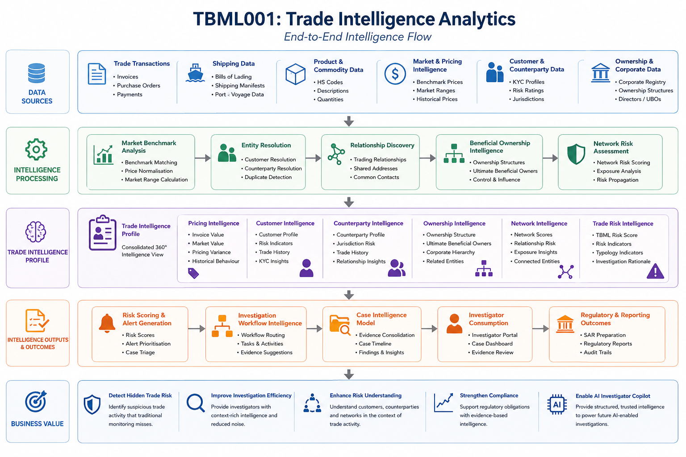
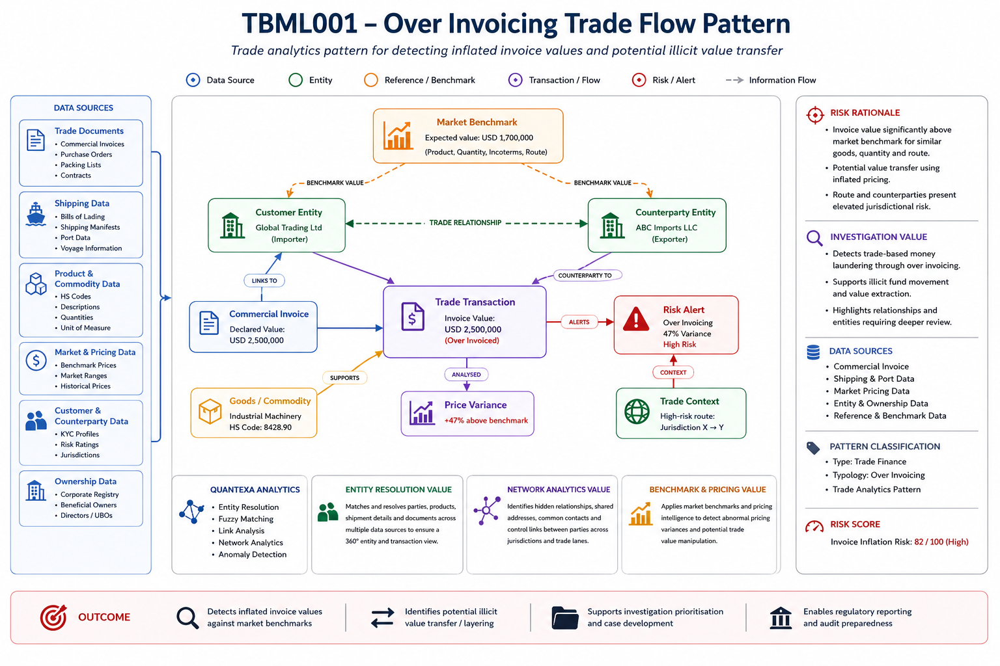

# TBML Analytics

## Executive Summary

Trade Based Money Laundering (TBML) is one of the most complex financial crime challenges facing financial institutions.

Unlike traditional transaction monitoring, TBML activity is often hidden within legitimate trade activity, commercial invoices, shipping documentation and cross-border trade relationships.

The objective of TBML Analytics is not simply to identify suspicious transactions. The objective is to transform trade transactions into actionable Trade Intelligence that combines pricing intelligence, ownership intelligence, network intelligence and risk intelligence.

This capability extends the Network Intelligence architecture established across Entity Resolution, Relationship Discovery, Beneficial Ownership Intelligence and Network Risk Assessment.

The result is a Trade Intelligence capability that supports investigation workflows, case intelligence generation and future AI-enabled investigation capabilities.

---

## Visual Intelligence Pattern



---

## Intelligence Question

Which trade transactions demonstrate pricing anomalies, ownership concerns, network risk indicators and cross-border trade patterns consistent with Trade Based Money Laundering activity?

---

## Pattern Objective

The objective of this capability is to identify trade transactions that may be facilitating illicit value transfer through invoice manipulation, ownership concealment, sanctions evasion or other Trade Based Money Laundering techniques.

The capability combines trade analytics with network intelligence to provide investigators with a complete intelligence view of the trade relationship.

---

## Capability Dependencies

This capability consumes intelligence from multiple upstream capabilities.

### Entity Resolution

Provides:

- Customer matching
- Counterparty matching
- Identity resolution
- Duplicate detection

### Relationship Discovery

Provides:

- Customer-counterparty relationships
- Related entity identification
- Shared ownership indicators
- Network connectivity analysis

### Beneficial Ownership Intelligence

Provides:

- Ownership structures
- Ultimate beneficial ownership
- Corporate hierarchy analysis
- Ownership risk indicators

### Network Risk Assessment

Provides:

- Network risk scores
- Relationship risk indicators
- Exposure analysis
- Connected entity intelligence

### Market Intelligence

Provides:

- Commodity pricing benchmarks
- Historical pricing information
- Expected market values
- Trade corridor intelligence

---

## Downstream Capabilities Enabled

The intelligence generated by this capability supports:

- Investigation Workflow Intelligence
- AML Alert Triage
- Trade Finance Investigations
- Sanctions Investigations
- Enhanced Due Diligence
- Suspicious Activity Reporting
- Emerging Threat Intelligence
- AI Investigator Copilot

---

## Trade Intelligence Lifecycle

```text
Trade Transaction
        ↓

Invoice Analysis
        ↓

Market Benchmark Comparison
        ↓

Entity Resolution
        ↓

Relationship Discovery
        ↓

Ownership Analysis
        ↓

Network Risk Assessment
        ↓

Trade Intelligence Profile
        ↓

Investigator Review
```

---

## How It Works

### Step 1 – Identify Trade Transactions

Trade transactions are ingested from operational systems.

Key attributes include:

- Customer
- Counterparty
- Commodity
- Invoice Value
- Jurisdiction
- Trade Corridor

### Step 2 – Compare Against Market Benchmarks

Invoice values are compared against expected market prices.

```text
Invoice Variance %

=
(Invoice Value - Expected Market Value)
----------------------------------------
Expected Market Value
```

Significant deviations may indicate potential over invoicing or under invoicing activity.

### Step 3 – Resolve Trade Participants

Entity Resolution identifies:

- Customer entities
- Counterparty entities
- Related entities
- Duplicate records

This establishes trusted identities for further analysis.

### Step 4 – Discover Relationships

Relationship Discovery identifies:

- Shared directors
- Shared ownership
- Shared addresses
- Shared contact information
- Historical trading relationships

### Step 5 – Assess Ownership Structures

Beneficial Ownership Intelligence identifies:

- Ultimate beneficial owners
- Layered ownership structures
- Offshore ownership vehicles
- High-risk ownership arrangements

### Step 6 – Assess Network Risk

Network Intelligence evaluates:

- Connected entities
- Historical investigations
- Sanctions exposure
- Network risk indicators
- Relationship complexity

### Step 7 – Generate Trade Intelligence Profile

The capability produces a structured Trade Intelligence Profile.

Rather than generating a simple alert, investigators receive a consolidated intelligence product.

---

## Intelligence Produced

### Trade Intelligence Profile

#### Pricing Intelligence

- Invoice Value
- Expected Market Value
- Variance Percentage
- Historical Pricing Comparison

#### Customer Intelligence

- Customer Profile
- Customer Risk Rating
- Customer History

#### Counterparty Intelligence

- Counterparty Profile
- Jurisdiction Information
- Trading History

#### Ownership Intelligence

- Beneficial Ownership
- Corporate Hierarchy
- Related Entities

#### Network Intelligence

- Network Risk Indicators
- Connected Entities
- Shared Ownership Links

#### Exposure Intelligence

- Sanctions Exposure
- Geographic Exposure
- Corridor Risk

#### Overall Risk Assessment

- Trade Risk Score
- TBML Risk Score
- Investigation Priority

- ---

## How Investigators Use It

Instead of manually reviewing large volumes of trade data, investigators receive a structured intelligence package.

Investigators can rapidly identify:

- Pricing anomalies
- Suspicious counterparties
- Ownership concerns
- Related entities
- Sanctions exposure
- Network risk indicators

This significantly reduces investigative effort while improving intelligence quality.

---

## Business Benefits

### Improved Detection

Combines multiple intelligence sources rather than relying solely on invoice values.

### Reduced False Positives

Contextual intelligence helps distinguish legitimate commercial activity from suspicious behaviour.

### Enhanced Investigations

Provides investigators with richer intelligence and supporting evidence.

### Better Explainability

Intelligence outputs can be traced back to source data and analytical processes.

### Stronger Regulatory Defensibility

Alerts are supported by explainable intelligence rather than black-box scoring.

---

## Example Network Pattern

### TBML001 – Over Invoicing

TBML001 demonstrates how Network Intelligence, market pricing data and trade analytics can be combined to identify potentially suspicious over-invoiced trade transactions.



tbml-trade-intelligence-journey.png

The pattern combines:

- Commercial invoice intelligence
- Trade transaction intelligence
- Market benchmark pricing
- Entity Resolution
- Relationship Discovery
- Beneficial Ownership Intelligence
- Network Risk Assessment

to generate a structured Trade Intelligence Profile supporting investigator decision-making.

---

## Navigation

### Upstream Intelligence Dependencies

⬅️ [Investigation Workflows](../01-network-intelligence/05-investigation-workflows/README.md)

⬅️ [Network Risk Assessment](../01-network-intelligence/04-network-risk-assessment/README.md)

### Downstream Intelligence Consumers

➡️ [Correspondent Banking Analytics](../03-correspondent-banking-analytics/README.md)

➡️ [Capital Markets Analytics](../04-capital-markets-analytics/README.md)

➡️ [Sanctions Exposure Analytics](../06-sanctions-exposure-analytics/README.md)

➡️ [AI Investigator Copilot](../05-ai-investigator-copilot/README.md)

---

## Intelligence Flow

```text
Network Intelligence
        ↓
Investigation Workflows
        ↓
Case Intelligence
        ↓
TBML Analytics
        ↓
Trade Intelligence
        ↓
Correspondent Banking Analytics
Capital Markets Analytics
AI Investigator Copilot
```

---

## Intelligence Dependency Chain

```text
Entity Resolution
        ↓
Relationship Discovery
        ↓
Beneficial Ownership Intelligence
        ↓
Network Risk Assessment
        ↓
Investigation Workflows
        ↓
Case Intelligence
        ↓
TBML Analytics
        ↓
Trade Intelligence
```

---

## Portfolio Position

TBML Analytics consumes intelligence generated by the Network Intelligence domain and applies that intelligence to trade activity, trade documentation, counterparties, trade routes and trade behaviours.

The capability transforms raw trade transactions into structured Trade Intelligence that can support downstream Financial Crime analytics and investigations.

Trade Intelligence produced by this capability can subsequently be consumed by:

- Correspondent Banking Analytics
- Capital Markets Analytics
- AI Investigator Copilot
- Enterprise Financial Crime Investigation Platforms

TBML Analytics therefore represents the first major operational analytics domain built on top of the Network Intelligence and Case Intelligence foundations.

---

## Key Message

Network Intelligence explains:

> Who is involved?

> How are they connected?

> Who owns what?

> What network risk exists?

Investigation Workflows transform that understanding into:

> Case Intelligence

TBML Analytics then applies that intelligence to trade activity and answers:

> Is the trade behaviour suspicious?

> Is the trade economically rational?

> Does the trade pattern indicate TBML typologies?

The resulting Trade Intelligence becomes a downstream input into wider Financial Crime investigations and AI-enabled investigator workflows.

---
