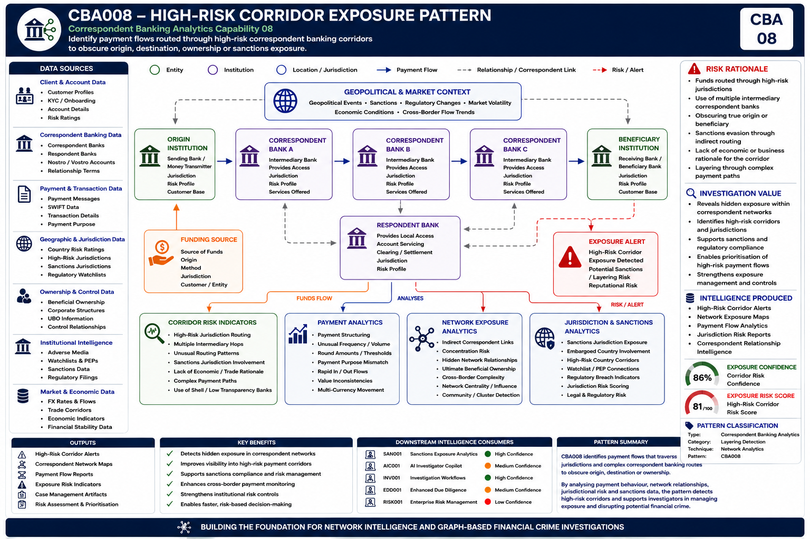

# Correspondent Banking Analytics

## Executive Summary

Correspondent banking forms the foundation of the global financial system, enabling financial institutions to facilitate cross-border payments, foreign exchange activity, trade finance transactions, and international liquidity management.

Banks rely on correspondent relationships to provide access to jurisdictions, currencies, and financial markets where they do not maintain a direct presence. While these relationships are essential to global commerce, they can also create significant financial crime, sanctions, regulatory, and reputational risks.

Unlike traditional transaction monitoring, correspondent banking risk often emerges through indirect relationships, nested banking arrangements, intermediary institutions, and complex payment routing structures that may obscure the true origin, destination, ownership, or control of funds.

The objective of Correspondent Banking Analytics is not simply to monitor payments. The objective is to transform payment activity, relationship structures, and institution networks into actionable Correspondent Intelligence that combines network intelligence, exposure intelligence, sanctions intelligence, jurisdictional intelligence, and risk intelligence.

This capability extends the Network Intelligence architecture established across Entity Resolution, Relationship Discovery, Beneficial Ownership Intelligence, Exposure Analytics, and Network Risk Assessment.

The result is a Correspondent Banking Intelligence capability that supports investigation workflows, risk-based decision-making, exposure management, and future AI-enabled investigation capabilities.

---

## Visual Intelligence Pattern

The following example demonstrates how Correspondent Banking Analytics identifies payment flows routed through high-risk correspondent banking corridors that may be used to obscure origin, destination, ownership, or sanctions exposure.

### CBA008 – High-Risk Corridor Exposure



---

## Intelligence Question

> Are payment flows being routed through high-risk jurisdictions, intermediary correspondent banks, or complex cross-border payment corridors to conceal beneficial ownership, evade sanctions controls, or disguise the true origin and destination of funds?

---

## Pattern Objective

Identify payment activity routed through high-risk correspondent banking corridors that may indicate financial crime exposure, sanctions evasion, hidden ownership structures, or layering activity.

The capability seeks to identify:

- High-risk payment corridors
- Complex multi-hop payment routes
- Indirect correspondent banking relationships
- Hidden beneficiary institutions
- Sanctions exposure pathways
- Jurisdictional risk concentration
- Unusual routing behaviour
- Obscured ownership and control structures

---

## Capability Dependencies

| Capability | Purpose |
|------------|----------|
| Entity Resolution | Resolve financial institutions across payment networks |
| Network Intelligence | Identify indirect correspondent relationships |
| Payment Analytics | Analyse transaction routing behaviour |
| Sanctions Exposure Analytics | Assess sanctions proximity and exposure |
| Risk Scoring | Prioritise exposure scenarios |
| AI Investigator Copilot | Support investigator decision-making |

---

## Downstream Capabilities Enabled

- Sanctions Exposure Analytics
- Enhanced Due Diligence
- Correspondent Risk Scoring
- AI Investigator Copilot
- Alert Prioritisation
- Regulatory Reporting
- Enterprise Investigation Platforms

---

## How It Works

The capability analyses payment flows, correspondent banking relationships, intermediary institutions, jurisdiction intelligence, and beneficiary institutions to construct multi-hop correspondent banking networks.

Network analytics identify indirect correspondent relationships, hidden routing pathways, and complex payment corridors that may obscure the true origin, destination, ownership, or control of funds.

Jurisdictional intelligence evaluates exposure to sanctioned regions, high-risk countries, regulatory watchlists, and elevated-risk payment routes.

Exposure analytics assess institutions, counterparties, beneficial ownership structures, and payment corridors to identify elevated-risk relationships and potential sanctions exposure.

The resulting intelligence provides investigators with visibility into hidden payment routing structures and correspondent banking exposure that would otherwise remain difficult to identify through traditional transaction monitoring approaches.

---

## Intelligence Produced

The capability generates:

- High-Risk Corridor Alerts
- Jurisdiction Exposure Intelligence
- Correspondent Network Exposure Maps
- Sanctions Routing Indicators
- Beneficial Ownership Exposure Intelligence
- Cross-Border Risk Intelligence
- Payment Corridor Intelligence
- Institution Exposure Profiles
- Correspondent Concentration Assessments

---

## How Investigators Use It

Investigators use the intelligence to:

- Assess correspondent banking exposure
- Understand complex payment routing structures
- Identify hidden correspondent relationships
- Detect high-risk jurisdiction exposure
- Support enhanced due diligence investigations
- Investigate sanctions-related payment activity
- Prioritise elevated-risk payment corridors
- Escalate significant exposure scenarios

---

## Business Benefits

### Improved Risk Visibility

Provides transparency into indirect correspondent relationships, payment corridors, and hidden banking exposure.

### Enhanced Regulatory Compliance

Supports correspondent banking oversight, sanctions compliance, and regulatory obligations.

### Faster Investigations

Provides investigators with pre-built relationship intelligence, jurisdiction context, and exposure analytics.

### Improved Risk Prioritisation

Enables resources to focus on the highest-risk correspondent banking relationships and payment corridors.

### Better Decision-Making

Supports risk-based decisions using network-driven exposure intelligence.

---

## Portfolio Position

Correspondent Banking Analytics consumes intelligence generated by the Network Intelligence domain and applies that intelligence to payment activity, institution relationships, correspondent networks, payment corridors, and cross-border financial flows.

The capability transforms payment activity into structured Correspondent Intelligence that can support downstream analytics and investigations.

Correspondent Intelligence produced by this capability can subsequently be consumed by:

- Sanctions Exposure Analytics
- AI Investigator Copilot
- Enhanced Due Diligence Processes
- Enterprise Financial Crime Investigation Platforms

Correspondent Banking Analytics therefore represents a critical intelligence layer connecting payment activity, network intelligence, sanctions exposure analysis, and investigator decision-making.

---

## Navigation

### Upstream Intelligence Dependencies

⬅️ [Network Intelligence](../01-network-intelligence)

### Downstream Intelligence Consumers

➡️ [Capital Markets Analytics](../04-capital-markets-analytics)

➡️ [Sanctions Exposure Analytics](../06-sanctions-exposure-analytics)

➡️ [AI Investigator Copilot](../05-ai-investigator-copilot)

---

## Intelligence Flow

```text
Network Intelligence
        ↓
Institution Resolution
        ↓
Payment Intelligence
        ↓
Correspondent Banking Analytics
        ↓
Correspondent Intelligence
        ↓
Sanctions Exposure Analytics
AI Investigator Copilot
Investigation Workflows
```

---

## Intelligence Dependency Chain

```text
Entity Resolution
        ↓
Relationship Discovery
        ↓
Institution Resolution
        ↓
Network Risk Assessment
        ↓
High-Risk Corridor Exposure
        ↓
Correspondent Intelligence
        ↓
Investigation Workflows
        ↓
Case Intelligence
```

---

## Key Message

Network Intelligence explains:

> Which institutions are connected?

> How do funds move between them?

> What exposure exists within the network?

Correspondent Banking Analytics transforms that understanding into actionable Correspondent Intelligence and answers:

> Which payment corridors create elevated financial crime risk?

> Which jurisdictions increase sanctions exposure?

> Which correspondent banking routes conceal ownership, control, or destination?

The resulting Correspondent Intelligence becomes a downstream input into sanctions investigations, investigator workflows, enhanced due diligence processes, and future AI-enabled financial crime operations.
