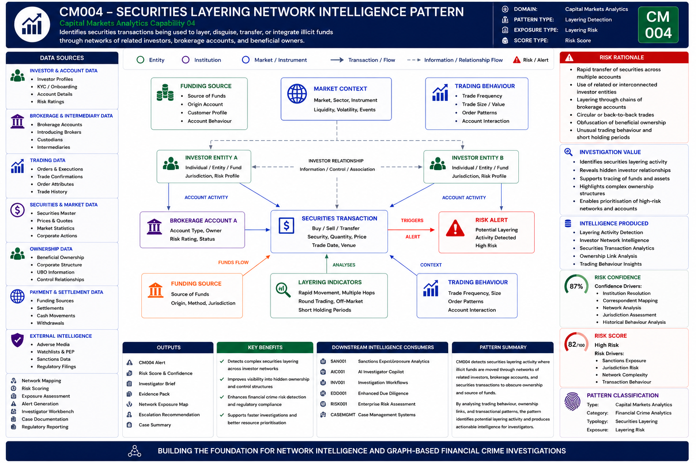

# Capital Markets Analytics

## Executive Summary

Capital markets provide a critical mechanism for raising capital, allocating investment, and supporting economic growth. Every day, financial institutions, investors, brokers, exchanges, and market participants execute vast volumes of securities transactions across global markets.

While these markets play an essential role in the financial system, they can also be exploited by criminal networks seeking to conceal ownership, layer illicit funds, manipulate markets, disguise transaction activity, and extract criminal proceeds.

Traditional surveillance approaches often focus on individual transactions or isolated trading events. However, many financial crime and market abuse risks emerge through networks of related investors, nominee account structures, beneficial ownership arrangements, coordinated trading behaviour, and complex securities transaction patterns that are difficult to identify through traditional monitoring techniques.

The objective of Capital Markets Analytics is not simply to monitor trades. The objective is to transform trading activity, investor relationships, ownership structures, market behaviour, and transaction intelligence into actionable Capital Markets Intelligence that combines network intelligence, ownership intelligence, behavioural intelligence, exposure intelligence, and risk intelligence.

This capability extends the Network Intelligence architecture established across Entity Resolution, Relationship Discovery, Beneficial Ownership Intelligence, Exposure Analytics, and Network Risk Assessment.

The result is a Capital Markets Intelligence capability that supports investigation workflows, market abuse detection, financial crime investigations, regulatory compliance obligations, and future AI-enabled investigation capabilities.

---

## Visual Intelligence Pattern

The following example demonstrates how Capital Markets Analytics identifies securities layering activity across networks of related investors, brokerage accounts, and beneficial ownership structures.

### CM004 – Securities Layering Network



---

## Intelligence Question

> Are securities transactions being used to layer, disguise, transfer, or integrate illicit funds through networks of related investors, brokerage accounts, and beneficial owners?

---

## Pattern Objective

Identify securities transactions that may be used to conceal ownership, layer illicit funds, disguise transaction activity, or integrate criminal proceeds through coordinated trading activity.

The capability seeks to identify:

- Securities layering activity
- Networks of related investors
- Hidden beneficial ownership
- Coordinated trading behaviour
- Structured transaction patterns
- Rapid asset movement
- Circular trading activity
- Financial crime exposure indicators

---

## Capability Dependencies

| Capability | Purpose |
|------------|----------|
| Entity Resolution | Resolve investors, entities, and brokerage accounts |
| Network Intelligence | Identify relationship structures and investor networks |
| Beneficial Ownership Intelligence | Understand ownership and control structures |
| Trading Analytics | Analyse securities transaction behaviour |
| Risk Scoring | Prioritise suspicious trading activity |
| AI Investigator Copilot | Support investigator decision-making |

---

## Downstream Capabilities Enabled

- Financial Crime Investigations
- Market Abuse Investigations
- AI Investigator Copilot
- Enhanced Due Diligence
- Regulatory Reporting
- Alert Prioritisation
- Enterprise Investigation Platforms

---

## How It Works

The capability analyses investor accounts, securities transactions, ownership structures, market activity, and relationship networks to identify behaviour consistent with layering and concealment of illicit funds.

Network analytics identify relationships between investors, brokerage accounts, intermediaries, and beneficial owners that may not be visible through traditional surveillance approaches.

Behavioural analytics assess trading frequency, transaction sequencing, asset movement patterns, timing, and account interactions to identify potential layering activity.

Exposure analytics evaluate ownership structures, counterparties, jurisdictions, and network proximity to determine the significance of identified risks.

The resulting intelligence provides investigators with visibility into complex trading networks and transaction structures that may indicate financial crime, market abuse, or money laundering activity.

---

## Intelligence Produced

The capability generates:

- Capital Markets Intelligence
- Investor Network Intelligence
- Beneficial Ownership Intelligence
- Trading Behaviour Intelligence
- Securities Layering Intelligence
- Financial Crime Exposure Intelligence
- Risk Assessments

---

## How Investigators Use It

Investigators use the intelligence to:

- Assess suspicious trading activity
- Identify hidden investor relationships
- Understand beneficial ownership structures
- Investigate layering behaviour
- Support enhanced due diligence reviews
- Prioritise high-risk investigations
- Escalate significant financial crime risks

---

## Business Benefits

### Improved Visibility

Provides transparency into complex investor networks and trading relationships.

### Enhanced Risk Detection

Identifies layering behaviour and concealed ownership structures that may not be visible through traditional surveillance approaches.

### Faster Investigations

Provides investigators with pre-built network intelligence and behavioural analysis.

### Improved Risk Prioritisation

Enables resources to focus on the highest-risk trading activity and investor networks.

### Better Decision-Making

Supports risk-based decisions using network-driven capital markets intelligence.

---

## Portfolio Position

Capital Markets Analytics consumes intelligence generated by the Network Intelligence domain and applies that intelligence to investor relationships, securities transactions, brokerage accounts, ownership structures, and market activity.

The capability transforms trading activity into structured Capital Markets Intelligence that can support downstream analytics and investigations.

Capital Markets Intelligence produced by this capability can subsequently be consumed by:

- Sanctions Exposure Analytics
- AI Investigator Copilot
- Investigation Workflows
- Enhanced Due Diligence Processes
- Enterprise Financial Crime Investigation Platforms

Capital Markets Analytics therefore represents a critical intelligence layer connecting investor behaviour, ownership structures, securities activity, and financial crime investigations.

---

## Navigation

### Upstream Intelligence Dependencies

⬅️ [Network Intelligence](../01-network-intelligence)

### Downstream Intelligence Consumers

➡️ [Sanctions Exposure Analytics](../06-sanctions-exposure-analytics)

➡️ [AI Investigator Copilot](../05-ai-investigator-copilot)

---

## Intelligence Flow

```text
Network Intelligence
        ↓
Capital Markets Analytics
        ↓
Capital Markets Intelligence
        ↓
Sanctions Exposure Analytics
        ↓
AI Investigator Copilot
        ↓
Investigation Workflows
        ↓
Case Intelligence
```

---

## Intelligence Dependency Chain

```text
Entity Resolution
        ↓
Relationship Discovery
        ↓
Beneficial Ownership Intelligence
        ↓
Network Risk Assessment
        ↓
Trading Relationship Intelligence
        ↓
Capital Markets Analytics
        ↓
Market Abuse Intelligence
```

---

## Key Message

Network Intelligence explains:

> Who is connected?

> Who owns what?

> What relationships exist?

Capital Markets Analytics transforms this understanding into actionable Capital Markets Intelligence and answers:

> Are securities transactions being used to layer illicit funds?

> Are investor networks concealing beneficial ownership?

> Do trading patterns indicate financial crime exposure?

The resulting Capital Markets Intelligence becomes a downstream input into sanctions investigations, investigator workflows, regulatory reporting, and future AI-enabled financial crime operations.
```
