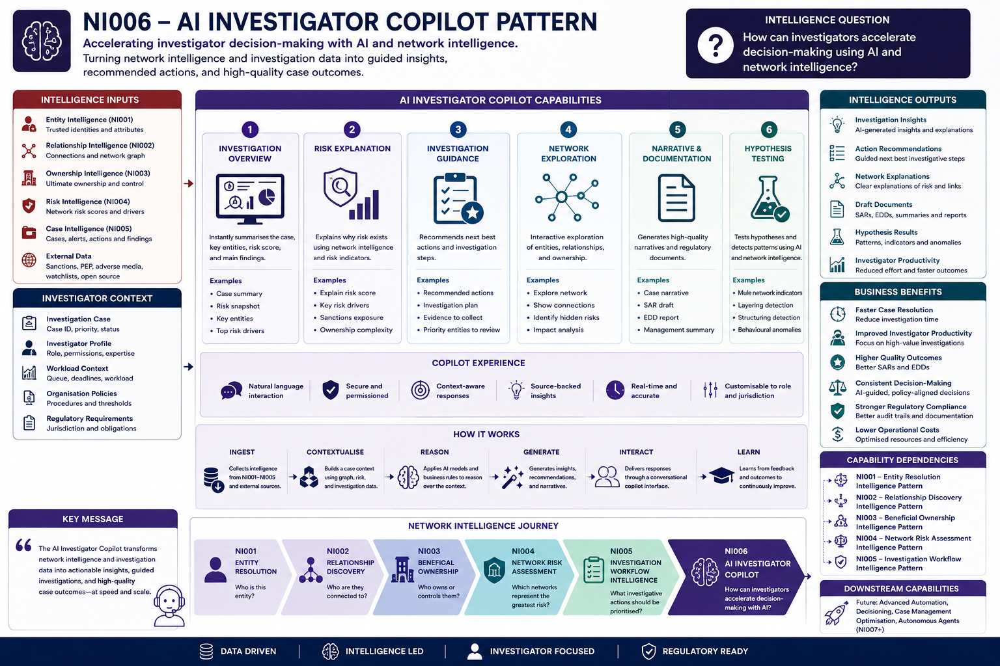
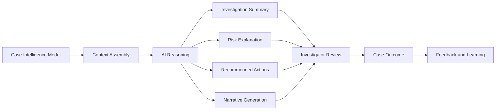

# NI006 – AI Investigator Copilot Intelligence Pattern

> Network Intelligence Capability 06

Accelerating investigator decision-making with AI and network intelligence.

---

## Executive Summary

Financial crime investigators often work across fragmented systems, large case files, complex ownership structures, network graphs, alerts, transactions, and regulatory documentation.

Even when high-quality intelligence exists, investigators still spend significant time manually interpreting data, reconstructing relationships, explaining risk, preparing narratives, and deciding what action to take next.

AI Investigator Copilot transforms fragmented investigation data into explainable investigation intelligence, reducing investigator effort while improving decision quality, consistency, speed, and regulatory defensibility.

The Copilot operationalises the intelligence produced by Entity Resolution, Relationship Discovery, Beneficial Ownership Intelligence, Network Risk Assessment, and Investigation Workflow Intelligence.

Rather than replacing investigators, the Copilot supports human-led investigation by assembling trusted context, explaining risk, recommending investigative actions, generating case narratives, and supporting evidence-based decision-making.

This capability transforms network intelligence into guided investigation support, enabling investigators to make faster, more consistent, and better-evidenced decisions.

---

## Visual Intelligence Pattern



---

## Intelligence Question

> How can investigators accelerate decision-making using AI and network intelligence?

AI Investigator Copilot helps investigators understand cases, explain risk, explore networks, generate narratives, and determine the next best investigative action.

This capability transforms case intelligence into AI-assisted investigation intelligence.

---

## Pattern Objective

AI Investigator Copilot acts as an investigation orchestration layer over the full Network Intelligence stack.

The capability enables:

- Investigation Summarisation
- Risk Explanation
- Investigation Guidance
- Network Exploration
- Narrative Generation
- Evidence Synthesis
- Hypothesis Testing
- Regulatory Drafting
- Investigator Decision Support

The objective is to reduce investigation effort while improving decision quality, consistency, explainability, and regulatory defensibility.

---

## Capability Dependencies

This capability depends on:

- [NI001 – Entity Resolution Intelligence Pattern](../01-network-intelligence/01-entity-resolution/README.md)
- [NI002 – Relationship Discovery Intelligence Pattern](../01-network-intelligence/02-relationship-discovery/README.md)
- [NI003 – Beneficial Ownership Intelligence Pattern](../01-network-intelligence/03-beneficial-ownership/README.md)
- [NI004 – Network Risk Assessment Intelligence Pattern](../01-network-intelligence/04-network-risk-assessment/README.md)
- [NI005 – Investigation Workflow Intelligence Pattern](../01-network-intelligence/05-investigation-workflows/README.md)

---

## Downstream Capabilities Enabled

- Future Case Automation
- Decision Management
- Regulatory Reporting Automation
- Autonomous Investigation Agents

---

## AI Investigator Copilot Lifecycle



---

## How AI Investigator Copilot Works

### Stage 1 – Case Context Assembly

The Copilot assembles investigation context from the Network Intelligence stack.

Inputs include:

- Trusted Entity Profiles
- Relationship Graphs
- Ownership Structures
- Network Risk Scores
- Risk Drivers
- Alerts
- Investigation Findings
- Case History
- Evidence Sources

Output:

- Case Intelligence Context

The result is a structured investigation context that the Copilot can reason over.

---

### Stage 2 – Investigation Summarisation

The Copilot generates a concise investigation overview.

Examples include:

- Case Summary
- Risk Snapshot
- Key Entities
- Key Relationships
- Ownership Summary
- Priority Risk Drivers
- Recommended Focus Areas

Output:

- Investigation Summary

This helps investigators understand the case quickly.

---

### Stage 3 – Risk Explanation

The Copilot explains why a case, entity, network, or ownership structure is high risk.

Examples include:

- Network Risk Drivers
- Sanctions Exposure
- PEP Exposure
- Ownership Complexity
- High-Risk Counterparties
- Behavioural Indicators
- Transaction Patterns
- Geographic Risk

Output:

- Explainable Risk Narrative

This supports investigator understanding, auditability, and regulatory defensibility.

---

### Stage 4 – Investigation Guidance

The Copilot recommends next best investigative actions.

Examples include:

- Review Ownership Chain
- Validate Sanctions Exposure
- Investigate High-Risk Counterparties
- Request Additional Documentation
- Review Transaction Cluster
- Escalate for Enhanced Due Diligence
- Prepare SAR Recommendation

Output:

- Recommended Investigation Actions

This converts intelligence into practical investigation steps.

### Stage 5 – Network Exploration

The Copilot helps investigators explore entities, relationships, ownership chains, and risk clusters.

Examples include:

- Show Highest-Risk Entities
- Explain Relationship Paths
- Identify Hidden Associates
- Summarise Ownership Chains
- Highlight Risk Clusters
- Identify Network Concentration
- Compare Related Entities

Output:

- Network Investigation Insights

This enables investigators to explore complex networks through natural language.

---

### Stage 6 – Narrative and Documentation Generation

The Copilot generates draft investigation narratives and case documentation.

Examples include:

- Case Narrative
- EDD Summary
- SAR Draft
- Management Summary
- Investigation Timeline
- Evidence Summary
- Decision Rationale

Output:

- Draft Investigation Documentation

This reduces manual writing effort while improving consistency and auditability.

---

### Stage 7 – Hypothesis Testing

The Copilot evaluates investigation hypotheses against available evidence.

Examples include:

- Possible Mule Network
- Possible Sanctions Evasion
- Possible Shell Company Structure
- Possible Hidden Beneficial Owner
- Possible Trade-Based Money Laundering
- Possible Circular Payment Activity

Output:

- Hypothesis Assessment

This supports structured investigation reasoning.

---

## Intelligence Produced

| Intelligence Output | Description |
|---------------------|-------------|
| Investigation Summaries | Concise summaries of case context and risk |
| Risk Explanations | Clear explanation of risk drivers |
| Recommended Actions | Suggested next investigative steps |
| Network Insights | AI-assisted interpretation of relationships and graph structures |
| Ownership Explanations | Summaries of ownership and control structures |
| Case Narratives | Draft investigation narratives |
| SAR Drafts | Suspicious activity report drafting support |
| EDD Summaries | Enhanced due diligence summaries |
| Hypothesis Assessments | Evidence-based assessment of investigation theories |
| Decision Rationale | Explanation of recommended case outcomes |

---

## How Investigators Use It

### Investigation Example

An investigator opens a high-priority case generated by Investigation Workflow Intelligence.

The case contains:

- Trusted entity profile
- Relationship graph
- Beneficial ownership structure
- Network risk score
- Risk drivers
- Alert history
- Investigation workflow status

AI Investigator Copilot immediately generates:

- A case summary
- Key risk drivers
- Network exposure explanation
- Ownership chain summary
- Recommended next actions
- Draft case narrative

The investigator asks:

> Why is this case high risk?

The Copilot explains:

- The customer is connected to high-risk counterparties
- The ownership chain includes offshore entities
- The network contains indirect sanctions exposure
- Several related entities share addresses and directors
- Transaction activity indicates unusual movement of funds

The investigator then asks:

> What should I do next?

The Copilot recommends:

- Review the ownership chain
- Validate sanctions exposure
- Investigate the offshore entity
- Review transaction flows
- Escalate for Enhanced Due Diligence

Instead of manually reconstructing the case, the investigator focuses on judgement, evidence review, and final decision-making.

---

## Architecture Considerations

AI Investigator Copilot is enabled by the Network Intelligence architecture established across Entity Resolution, Relationship Discovery, Beneficial Ownership Intelligence, Network Risk Assessment, and Investigation Workflow Intelligence.

Rather than reasoning over raw data, the Copilot consumes a structured Case Intelligence Model containing trusted entity intelligence, relationship intelligence, ownership intelligence, risk intelligence, investigation findings, and workflow context.

This architecture enables explainable AI, consistent investigation outcomes, reduced hallucination risk, and regulatory defensibility.

Detailed implementation patterns are documented within the AI Investigator Copilot Reference Architecture.

➡️ [AI Investigator Copilot Reference Architecture](https://github.com/danhartwig-fc/fc-prot02-ai-investigator-copilot)

---

## Why The Copilot Can Be Trusted

AI Investigator Copilot is designed as a human-in-the-loop investigation support capability.

It does not replace investigator judgement or autonomously make regulatory decisions.

The Copilot is trusted because it:

- Reasons over curated intelligence rather than unstructured raw data
- Uses outputs from validated Network Intelligence capabilities
- Grounds summaries and recommendations in available case evidence
- Provides explainable risk drivers and decision rationale
- Supports investigator review before action is taken
- Maintains auditability through documented findings, sources, and outcomes
- Reduces hallucination risk by relying on structured Case Intelligence Models
- Supports regulatory defensibility through consistent, evidence-led narratives

The result is AI-assisted investigation, not AI-only investigation.

---

## Business Benefits

### Investigation Benefits

- Faster case understanding
- Reduced manual investigation effort
- Better investigator productivity
- Improved decision consistency
- More focused evidence review

### Operational Benefits

- Reduced case handling time
- Improved workflow throughput
- Better investigator capacity
- More consistent case documentation
- Lower operational friction

### Risk Benefits

- Better understanding of network risk
- Stronger risk explanations
- Improved identification of hidden exposure
- Better ownership and relationship interpretation
- More effective escalation decisions

### Regulatory Benefits

- Stronger audit trails
- Better documented decision rationale
- Improved SAR and EDD quality
- More explainable investigation outcomes
- Greater regulatory defensibility

---

## Network Intelligence Journey

```text
Entity Resolution
        ↓
Relationship Discovery
        ↓
Beneficial Ownership Analysis
        ↓
Network Risk Assessment
        ↓
Investigation Workflows
        ↓
════════════════════════
AI Investigator Copilot
```

---

## Navigation

⬅️ **Previous:** [Investigation Workflows](../01-network-intelligence/05-investigation-workflows/README.md)

➡️ **Next:** [Network Intelligence Platform](../README.md)

---

## Key Message

Entity Resolution answers:

> "Who is this entity?"

Relationship Discovery answers:

> "Who are they connected to?"

Beneficial Ownership Intelligence answers:

> "Who ultimately owns, controls, or benefits from this entity?"

Network Risk Assessment answers:

> "Which entities, networks, and ownership structures represent the highest priority financial crime risks?"

Investigation Workflow Intelligence answers:

> "What investigative actions should be taken and prioritised?"

AI Investigator Copilot answers:

> "How can investigators accelerate decisions using trusted network intelligence?"

Together these capabilities transform financial crime investigation from manual analysis into AI-assisted, intelligence-led decision-making.

The AI Investigator Copilot does not replace investigators.

It augments investigators by:

- Explaining risk
- Summarising complex cases
- Recommending next actions
- Generating investigation narratives
- Supporting hypothesis testing
- Accelerating regulatory reporting

This capability represents the culmination of the Network Intelligence architecture, transforming Identity Intelligence, Relationship Intelligence, Ownership Intelligence, Risk Intelligence, and Case Intelligence into AI-assisted investigation outcomes.
