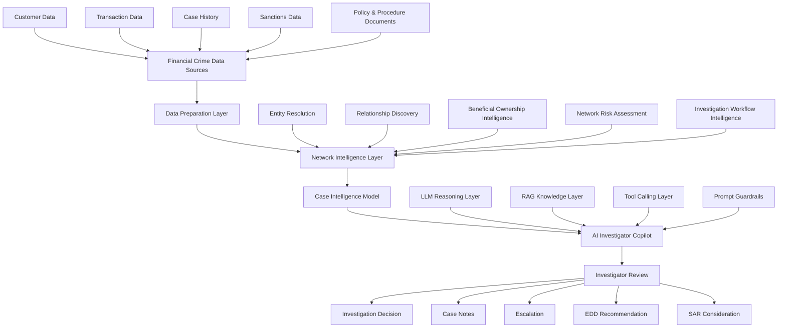

# AI Investigator Copilot Reference Architecture

## Executive Summary

The AI Investigator Copilot is designed as a human-in-the-loop investigation support capability for financial crime teams.

It helps investigators gather evidence, understand customer risk, review network intelligence, summarise case context and prepare investigation outputs.

The Copilot does not replace investigator judgement. It provides structured support by consuming trusted intelligence outputs from the wider Financial Crime Analytics architecture.

---

## Architecture Purpose

The purpose of this reference architecture is to show how an AI Investigator Copilot can be safely connected to financial crime data, analytics and investigation workflows.

The architecture is designed to support:

- Alert triage
- Case summarisation
- Customer risk review
- Transaction explanation
- Network intelligence interpretation
- Beneficial ownership review
- Investigation workflow support
- Human decision-making

---

## Core Design Principle

The Copilot should not reason directly over raw, ungoverned data.

Instead, it should consume a structured Case Intelligence Model built from trusted upstream capabilities.

This reduces hallucination risk, improves explainability and makes the Copilot more suitable for regulated financial crime environments.

---

## High-Level Architecture



## Architecture Layers

### 1. Financial Crime Data Sources

The Copilot relies on information from multiple financial crime systems.

Typical sources include:

- Customer records
- KYC profiles
- Transaction monitoring alerts
- Transaction history
- Case management records
- Sanctions screening results
- Adverse media outputs
- Beneficial ownership data
- Internal policies and procedures
- Regulatory guidance
- Typology documentation

These sources provide the raw material for investigation support.

---

### 2. Data Preparation Layer

The data preparation layer cleans, standardises and structures source data before it is used by downstream analytics or AI components.

This layer may include:

- Data ingestion
- Data quality controls
- Entity standardisation
- Duplicate removal
- Identifier resolution
- Data matching
- Date normalisation
- Currency normalisation
- Risk attribute enrichment

The objective is to create trusted and consistent investigation data.

---

### 3. Network Intelligence Layer

The Network Intelligence Layer transforms prepared data into intelligence products that can be consumed by the Copilot.

This layer includes:

- Entity Resolution
- Relationship Discovery
- Beneficial Ownership Intelligence
- Network Risk Assessment
- Investigation Workflow Intelligence

Rather than discovering every relationship itself, the Copilot consumes trusted outputs generated by these specialist intelligence capabilities.

This architecture improves explainability and reduces AI hallucination risk.

---

### 4. Case Intelligence Model

The Case Intelligence Model acts as the structured evidence package presented to the Copilot.

It may contain:

- Customer profile
- Alert summary
- Transaction summary
- Counterparty analysis
- Relationship intelligence
- Beneficial ownership information
- Historical investigation context
- Risk indicators
- Regulatory references
- Policy references
- Recommended investigation actions

The Case Intelligence Model becomes the Copilot's primary evidence source.

---

### 5. AI Investigator Copilot Layer

The AI Investigator Copilot interprets the Case Intelligence Model and supports the investigator throughout the investigation lifecycle.

Capabilities may include:

- Case summarisation
- Alert explanation
- Risk indicator identification
- Transaction interpretation
- Investigation guidance
- Network intelligence interpretation
- SAR drafting assistance
- Investigation note generation
- Regulatory guidance retrieval

The Copilot does not make decisions.

It provides structured recommendations and explanations which are reviewed by investigators.

---

### 6. Human Review Layer

The investigator remains accountable for investigation outcomes.

Human review ensures:

- Evidence validation
- Recommendation challenge
- Regulatory judgement
- Escalation decisions
- SAR decisions
- Investigation closure decisions

The architecture is intentionally designed around a human-in-the-loop operating model.

---

## Investigator Journey


---

## Example Investigation Scenario

A transaction monitoring alert is generated involving an offshore entity and unusual payment activity.

The Case Intelligence Model contains:

- Customer profile
- Alert information
- Transaction history
- Counterparty intelligence
- Beneficial ownership information
- Relationship intelligence
- Previous investigations
- Policy references

The investigator asks:

> Why has this customer triggered an alert and what should I review?

The Copilot provides:

- Plain English explanation of the alert
- Key transaction observations
- Relevant network relationships
- Beneficial ownership concerns
- Previous investigation findings
- Potential risk indicators
- Suggested investigation actions
- Relevant policy references

The investigator reviews the information and decides whether to:

- Close the case
- Escalate the investigation
- Perform Enhanced Due Diligence
- Consider SAR escalation

---

## Why The Copilot Can Be Trusted

The architecture improves trust because the Copilot:

- Consumes structured intelligence rather than raw data
- References source evidence
- Supports rather than replaces investigators
- Does not make autonomous regulatory decisions
- Maintains human accountability
- Can be audited
- Can be governed through access controls
- Can be tested against investigation scenarios

The Copilot operates as an investigation support capability rather than an autonomous decision-maker.

---

## Governance Considerations

The architecture should include controls for:

### Access Controls

- Role-based access management
- Need-to-know access
- Segregation of duties

### AI Governance

- Prompt governance
- Model governance
- Version control
- Output monitoring

### Investigation Governance

- Human approval checkpoints
- Source traceability
- Evidence lineage
- Decision accountability

### Regulatory Governance

- Audit logging
- Explainability
- Defensibility
- Regulatory reporting support

---

## Relationship To Network Intelligence

The AI Investigator Copilot consumes outputs from the wider Network Intelligence architecture.

Primary upstream dependencies include:

- Entity Resolution
- Relationship Discovery
- Beneficial Ownership Intelligence
- Network Risk Assessment
- Investigation Workflow Intelligence

These capabilities transform raw data into trusted intelligence products that can be safely consumed by AI.

The Copilot therefore becomes the consumer of intelligence rather than the creator of intelligence.

---

## Relationship To Future AI Capabilities

The architecture establishes a reusable pattern for future Financial Crime AI capabilities including:

- Financial Crime Knowledge Assistant
- Sanctions Intelligence Assistant
- Financial Crime Threat Analysis Explorer
- AML Workflow Automation
- MCP Financial Crime Toolkit

This enables a common architecture approach across the Financial Crime AI portfolio.

---

## Recommended Repository Structure

```text
05-ai-investigator-copilot/
│
├── README.md
│
├── reference-architecture/
│   ├── README.md
│   ├── ai-investigator-copilot-architecture.drawio
│   ├── ai-investigator-copilot-architecture.png
│   ├── ai-investigator-copilot-sequence-diagram.png
│   └── ai-investigator-copilot-data-flow.png
│
├── prompts/
├── examples/
├── notebooks/
├── src/
└── docs/
```

---

## Future Architecture Extensions

Potential future enhancements include:

- MCP integration layer
- Agent orchestration layer
- Multi-agent investigator workflows
- Real-time intelligence enrichment
- Investigation memory layer
- Case recommendation engine
- Explainability dashboard
- Human feedback learning loop

---

## Key Message

The AI Investigator Copilot is not a chatbot sitting on top of financial crime data.

It is an investigation support capability built on trusted intelligence, structured evidence, network analytics and human review.

Its value comes from combining AI assistance with explainable, governed and regulator-defensible investigation intelligence.
