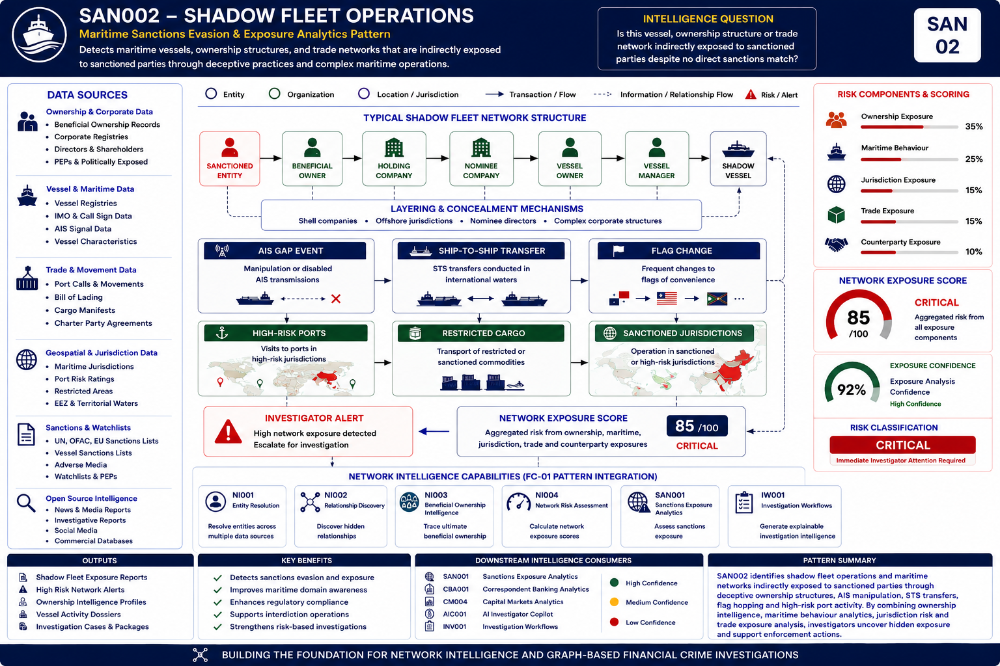

# 🌍 Sanctions Exposure Analytics

## Executive Summary

Sanctions Exposure Analytics demonstrates how Financial Institutions can move beyond traditional sanctions screening and identify hidden sanctions exposure through ownership analysis, network intelligence, maritime analytics, trade controls monitoring and sanctions evasion detection.

The capability combines Entity Resolution, Beneficial Ownership Intelligence, Relationship Discovery, Maritime Intelligence and Network Analytics to uncover indirect sanctions exposure that may not be identified through conventional sanctions screening approaches.

Unlike traditional sanctions screening solutions that focus primarily on direct sanctions matches, Sanctions Exposure Analytics provides explainable intelligence capable of identifying hidden ownership structures, indirect exposure relationships and sanctions evasion indicators across customer, trade and maritime ecosystems.

The result is a Sanctions Intelligence capability that supports investigation workflows, case intelligence generation and future AI-enabled investigative operations.

---

## Visual Intelligence Pattern

### SAN002 – Shadow Fleet Operations

The following example demonstrates how Sanctions Exposure Analytics extends traditional sanctions screening by combining ownership analysis, network intelligence, maritime analytics and exposure scoring.

Shadow Fleet Operations represent one of the most complex sanctions evasion typologies currently observed across global trade and maritime networks.

The typology demonstrates how indirect ownership structures, vessel behaviour, maritime logistics networks and sanctions exposure relationships can be combined to conceal beneficial ownership and facilitate sanctions evasion.



---

## Intelligence Question

> Is this vessel, ownership structure, customer, counterparty or trade network indirectly exposed to sanctioned parties despite no direct sanctions match?

---

## Pattern Objective

The capability seeks to:

- Identify hidden sanctions exposure
- Detect ownership concealment structures
- Assess beneficial ownership risk
- Discover sanctions-related network relationships
- Identify maritime sanctions evasion indicators
- Analyse trade controls exposure
- Support investigator decision making
- Produce explainable sanctions intelligence

---

## Capability Dependencies

| Capability | Purpose |
|------------|----------|
| Entity Resolution | Resolve customers, counterparties, vessels and ownership entities |
| Relationship Discovery | Identify hidden sanctions relationships |
| Beneficial Ownership Intelligence | Trace ownership and control structures |
| Network Risk Assessment | Quantify exposure risk |
| Maritime Intelligence | Analyse vessel behaviour and sanctions indicators |
| Trade Exposure Intelligence | Assess commodity and trade-control exposure |

---

## Downstream Capabilities Enabled

- AI Investigator Copilot
- Investigation Workflows
- Case Intelligence
- Enhanced Due Diligence
- Regulatory Reporting
- Enterprise Risk Management
- Financial Crime Intelligence Platforms

---

## Intelligence Flow

```text
Network Intelligence
        ↓
Sanctions Exposure Analytics
        ↓
Sanctions Intelligence
        ↓
AI Investigator Copilot
        ↓
Investigation Workflows
        ↓
Case Intelligence
```

---

## Intelligence Dependency Chain

```text
Entity Resolution
        ↓
Relationship Discovery
        ↓
Beneficial Ownership Intelligence
        ↓
Network Risk Assessment
        ↓
Maritime Intelligence
        ↓
Trade Exposure Intelligence
        ↓
Sanctions Exposure Analytics
        ↓
Sanctions Intelligence
```

---

## Portfolio Position

Sanctions Exposure Analytics consumes intelligence generated by the Network Intelligence capability stack and combines ownership intelligence, relationship intelligence, maritime intelligence and trade intelligence to identify hidden sanctions exposure.

The capability transforms ownership, vessel, customer and trade activity into structured Sanctions Intelligence suitable for investigation workflows, case management systems and AI-enabled investigative operations.

---

## Intelligence Produced

The capability generates:

- Ownership Exposure Intelligence
- Maritime Risk Intelligence
- Network Exposure Intelligence
- Trade Exposure Intelligence
- Sanctions Exposure Intelligence
- Beneficial Ownership Assessments
- Vessel Exposure Assessments
- Trade Controls Intelligence
- Exposure Risk Scores
- Investigation Recommendations

---

## Business Benefits

### Hidden Exposure Detection

Identifies indirect sanctions exposure that traditional sanctions screening may fail to detect.

### Enhanced Investigations

Provides investigators with explainable intelligence supporting sanctions investigations.

### Reduced False Positives

Uses contextual intelligence to prioritise meaningful sanctions risks.

### Improved Regulatory Defensibility

Supports regulatory obligations through evidence-based intelligence and explainable exposure assessments.

### Enhanced Risk Understanding

Provides visibility into ownership structures, trade relationships and maritime networks.

### AI-Ready Intelligence

Produces structured intelligence suitable for AI-assisted investigative workflows.

---

## Example Typologies

| ID | Typology | Focus Area |
|-----|----------|------------|
| SAN001 | Beneficial Ownership Evasion | Concealed ownership and control structures |
| SAN002 | Shadow Fleet Operations | Maritime sanctions evasion and vessel networks |
| SAN003 | Transshipment Evasion | Jurisdiction and routing concealment |
| SAN004 | Front Companies & Shell Networks | Corporate concealment structures |
| SAN005 | Indirect Sanctions Exposure Networks | Hidden exposure through relationships |
| SAN006 | Trade-Based Sanctions Evasion | Trade controls and commodity exposure |
| SAN007 | Export Controls & Dual-Use Goods Evasion | Export control violations |
| SAN008 | Maritime Concealment & Vessel Deception | AIS manipulation and vessel behaviour |
| SAN009 | Complex Ownership & Control Structures | Multi-layer ownership networks |

---

## Navigation

### Previous Capability

⬅️ [Capital Markets Analytics](../04-capital-markets-analytics/README.md)

### Upstream Dependency

🔗 [Network Intelligence](../01-network-intelligence/README.md)

### Downstream Capability

➡️ [AI Investigator Copilot](../05-ai-investigator-copilot/README.md)

---

## Key Message

Traditional sanctions screening identifies direct sanctions matches.

Sanctions Exposure Analytics identifies hidden ownership, control, trade and network relationships that reveal indirect sanctions exposure, sanctions evasion activity and emerging sanctions risks that would otherwise remain undetected.

The capability transforms raw ownership, maritime and trade data into explainable Sanctions Intelligence that supports investigations, case intelligence generation and future AI-enabled financial crime operations.
