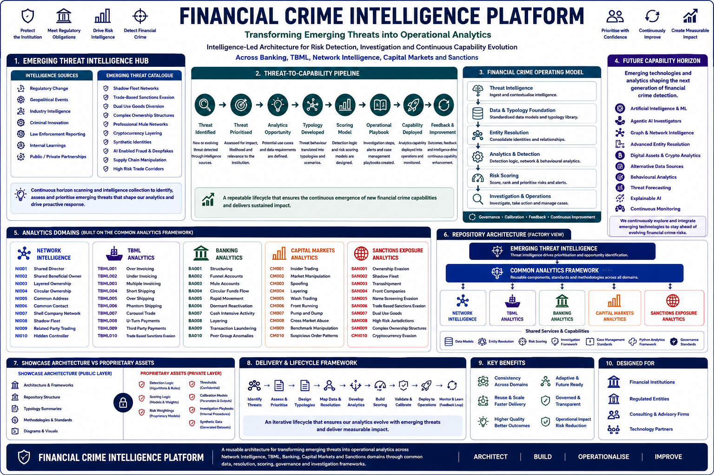

# Financial Crime Analytics Showcase

Portfolio of Financial Crime Analytics, Network Intelligence, Trade-Based Money Laundering Detection, Correspondent Banking Analytics, Capital Markets Surveillance and AI-Enabled Investigation Workflows.

---

## Financial Crime Intelligence Platform

This repository forms part of the broader Financial Crime Intelligence Platform architecture.

The platform demonstrates how intelligence, analytics, network intelligence, investigations and artificial intelligence can be combined into a modern intelligence-led Financial Crime operating model.



---

## Intelligence-Led Operating Model

The showcase is built around the principle that effective Financial Crime capabilities begin with intelligence.

Threat intelligence, typology development and risk assessment inform detection strategies, which in turn drive analytics, investigations and operational decision-making.

This repository demonstrates how intelligence can be translated into actionable analytical and investigative capabilities across multiple Financial Crime domains.

---

# Start Here

This showcase is organised as a guided capability journey.

Each section demonstrates how analytical techniques can be applied to solve real Financial Crime challenges and support operational investigations.

---

## Capability Journey

| Step | Capability | Focus |
|--------|--------|--------|
| 01 | Network Intelligence | Entity Resolution, Beneficial Ownership and Relationship Discovery |
| 02 | TBML Analytics | Trade-Based Money Laundering Detection and Trade Intelligence |
| 03 | Correspondent Banking Analytics | Nested Respondent Risk and Payment Network Analytics |
| 04 | Capital Markets Analytics | Market Abuse Detection and Trading Surveillance |
| 05 | AI Investigator Copilot | AI-Assisted Investigation and Decision Support |

---

# Recommended Viewing Order

The showcase has been designed to be explored in the following sequence:

```text
Network Intelligence
        ↓
TBML Analytics
        ↓
Correspondent Banking Analytics
        ↓
Capital Markets Analytics
        ↓
AI Investigator Copilot
```

This progression demonstrates how analytical capabilities evolve from data and network intelligence through to investigation support and AI-enabled operations.

---

# 01 Network Intelligence

Network Intelligence forms the foundation of modern Financial Crime investigations.

### Example Capabilities

- Entity Resolution
- Beneficial Ownership Analysis
- Relationship Discovery
- Network Investigation Workflows

### Key Outcome

Transform isolated customer records into connected investigative intelligence.

➡️ Open: `01-network-intelligence`

---

# 02 TBML Analytics

Trade-Based Money Laundering remains one of the most complex Financial Crime challenges.

### Example Capabilities

- Over-Invoicing Detection
- Under-Invoicing Detection
- Trade Route Analytics
- Trade Network Intelligence

### Key Outcome

Identify hidden value transfer through international trade activity.

➡️ Open: `02-tbml-analytics`

---

# 03 Correspondent Banking Analytics

Correspondent Banking networks create complex payment pathways and indirect exposure risks.

### Example Capabilities

- Nested Respondent Analysis
- Payment Corridor Risk
- Exposure Mapping
- Network Risk Assessment

### Key Outcome

Identify hidden risk concentrations across correspondent banking relationships.

➡️ Open: `03-correspondent-banking-analytics`

---

# 04 Capital Markets Analytics

Market abuse investigations increasingly rely on advanced analytics and network intelligence techniques.

### Example Capabilities

- Wash Trading Detection
- Market Manipulation Analytics
- Trading Network Analysis
- Behavioural Surveillance

### Key Outcome

Identify suspicious trading behaviour and connected market participants.

➡️ Open: `04-capital-markets-analytics`

---

# 05 AI Investigator Copilot

Artificial Intelligence can enhance investigator productivity and support decision-making across Financial Crime operations.

### Example Capabilities

- Alert Summarisation
- Investigation Guidance
- Relationship Explanation
- SAR Narrative Support

### Key Outcome

Enable faster, more consistent and explainable investigations.

➡️ Open: `05-ai-investigator-copilot`

---

# Design Principles

The showcase is built around six core principles:

- Intelligence-Led Decision Making
- Risk-Based Prioritisation
- Explainable Analytics
- Network-Centric Investigations
- Human-AI Collaboration
- Operational Decision Support

---

# Repository Status

This repository is actively being developed as a showcase of Financial Crime Analytics, Network Intelligence and AI-enabled operating models.

Additional capabilities, visualisations and investigation journeys will be added over time.

---

© 2026 Dan Hartwig | Financial Crime Transformation Portfolio
